# Lab #2 - Implementação da aplicação web front-end na OCI
**Objetivo desse Lab:**

Nesta etapa você fará a implementação do front-end da aplicação web na OCI como container sendo executado em um cluster Kubernetes!
**Você aprenderá todo o passo-a-passo dessa implementação:**
 - [Passo 1: Clonar o repositório com a pagina web utilizando o Cloud Shell](#Passo1)
 - [Passo 2: Adicionar as informações necessarias para utilizar o Application Performance Monitoring (APM)](#Passo2)
 - [Passo 3: Build da Imagem da aplicação web](#Passo3)
 - [Passo 4: Envio da Imagem para o repositório do OCIR](#Passo4)
 - [Passo 5: Acesso ao Cluster Kubernetes](#Passo5)
 - [Passo 6: Criação de um Secret para coleta da Imagem no OCIR](#Passo6)
 - [Passo 7: Aplicação do Manifesto Kubernetes](#Passo7)
 - [Passo 8: Acesso à aplicação web](#Passo8)
## <a name="Passo1"></a> Passo 1: Clonar o repositório com a pagina web utilizando o Cloud Shell
1. Faça login em sua conta na Cloud. [link](https://www.oracle.com/cloud/sign-in.html)
2. Clique no botão do Cloud Shell no canto superior direito, ao lado do nome da região:
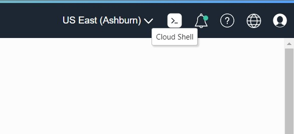
3. Abra uma nova aba em seu navegador e entre no link: [CeInnovationTeam/FrontFTDev (github.com)](https://github.com/CeInnovationTeam/FrontFTDev)
4. Clique em **code** e depois copie o link do repositório

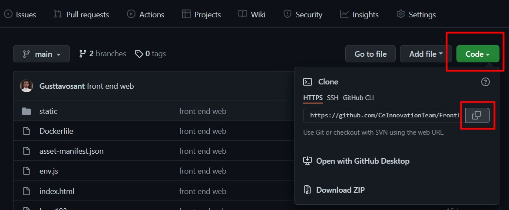

5. Volte para a pagina da cloud e no Cloud Shell digite:
	`git clone <link-do-repositorio> `

  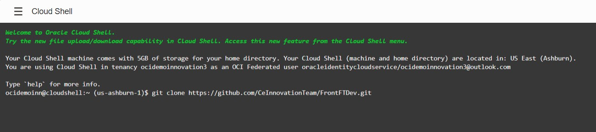

Após clonar a imagem finalizamos o primeiro tópico
## <a name="Passo2"></a> Passo 2: Adicionar as informações necessarias para utilizar o Application Performance Monitoring (APM)
Para utilizar o APM na sua aplicação web você precisará salvar algumas informações de sua conta na cloud.
1. Clique no menu lateral, vá até Observability & Management e depois clique em Application Performance Monitoring


2. Clique no drop box ao lado de home e depois em **Administration**

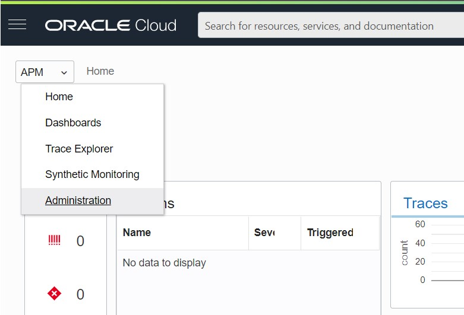

3. Selecione o Compartment que está suas aplicações e depois selecione o APM Domain que foi criado com o Terraform

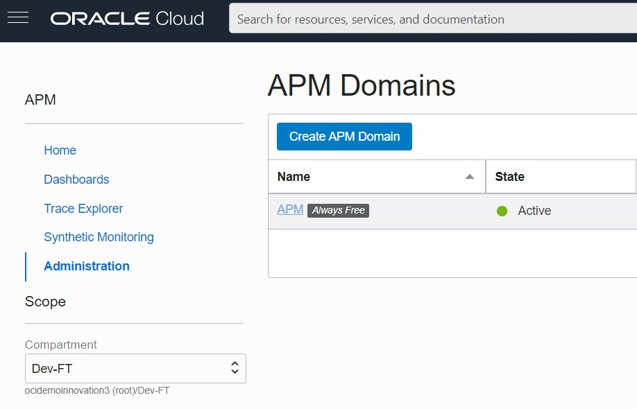

4. Copie o **Data Upload Endpoint** e o **auto_generated_public_datakey** em um bloco de notas

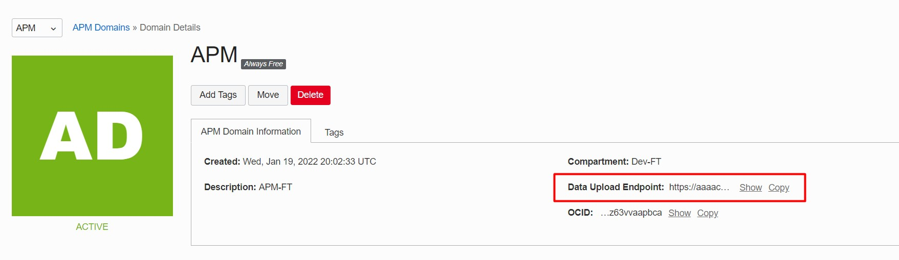

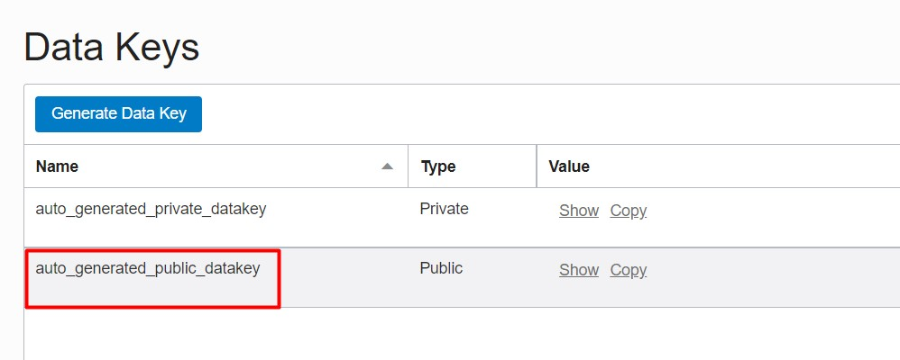

5. Copie o conteúdo do bloco abaixo em outro bloco de notas e altere os campos:
	-  < APM Browser> adicione um nome para sua aplicação, como "App web"
	- < Web App Name> adicione um nome para sua aplicação, como "App web"
	- < ociDataUploadEndpoint > adicione o **Data Upload Endpoint** copiado nos passos anteriores
	- < APM_Public_Datakey > adicione o **auto_generated_public_datakey** copiado nos passos anteriores
	- src="< **ociDataUploadEndpoint** >/static/jslib/apmrum.min.js"> adicione o **Data Upload Endpoint** copiado nos passos anteriores
```javascript
<script>
window.apmrum = (window.apmrum || {});
window.apmrum.serviceName='<APM Browser>';
window.apmrum.webApplication='<Web App Name>';
window.apmrum.ociDataUploadEndpoint='<ociDataUploadEndpoint>';
window.apmrum.OracleAPMPublicDataKey='<APM_Public_Datakey>';
</script>
<script async crossorigin="anonymous" src="<ociDataUploadEndpoint>/static/jslib/apmrum.min.js"></script>
```
6. No Cloud Shell, adicione os comandos:
- `cd FrontFTDev`
Para entrar na pasta do projeto que foi clonada no GitHub
- `ls `
Para listar os arquivos que contém na pasta

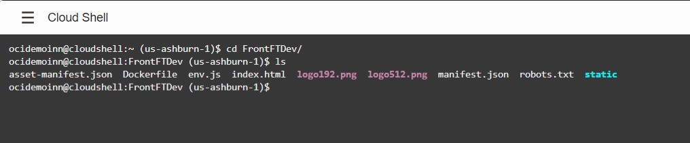

- `vim index.html`
Para editar o arquivo html e adicionar os scripts que você editou no passo anterior
7. Pressione a tecla **"i"** para editar o arquivo, vá até o final da tag < /body > pressione **Enter** e cole os scripts editados que você copiou do seu bloco de notas
8. Pressione **Esc** e depois digite "**:wq!**" para salvar o arquivo

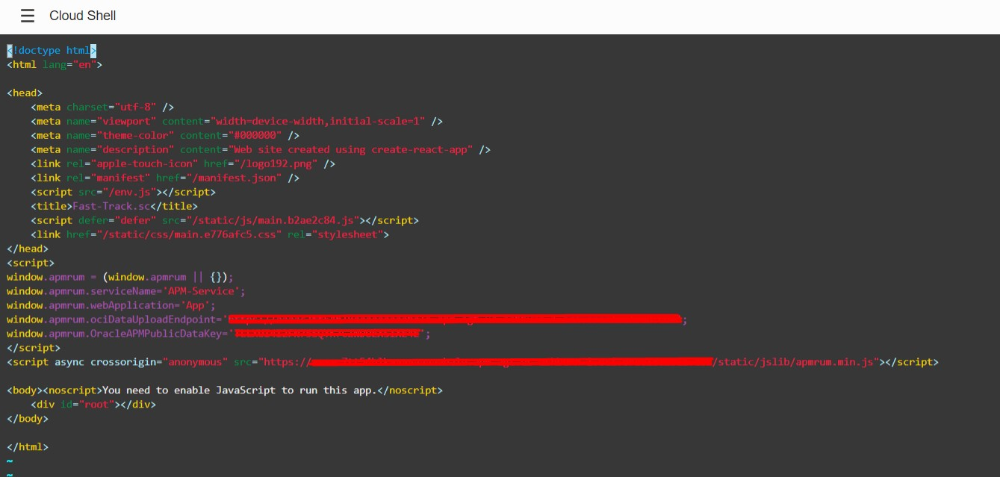

Após finalizar este passo finalizamos o segundo tópico.

## <a name="Passo3"></a> Passo: 3 Build na Imagem
1. Clique no icone de perfil no canto superior direito, clique em Tenancy: nomeDaSuaTenacy
2. Ao entrar você verá algumas informações de sua Tenancy, copie o que está no campo **Object Storage Namespace** em um bloco de notas
3. No Cloud Shell,  adicione os comandos:
- `docker build -t app:latest .`
Para dar build na imagem da sua aplicação
- `docker tag app:latest <código de região>.ocir.io/<tenancy-namespace>/app:latest`
- Altere o <código-de-região> para o código de referencia de sua região **composto por 3 letras**, utilize a [tabela de referencia](https://docs.oracle.com/en-us/iaas/Content/General/Concepts/regions.htm)
- Altere o <tenancy-namespace> para o nome que você copiou em seu bloco de notas.


## <a name="Passo4"></a> Passo 4: Envio da Imagem para o OCIR
Neste momento, é necessário enviar a imagem construída para o repositório no OCIR.

### 1. Docker Push
1. O `docker push` será responsável por tomar a imagem e enviá-la para o OCIR. Para isso, no **Cloud Shell** execute o seguinte comando, substituindo o `<tenancy-namespace>`e o `<image-tag>`:
```python
docker push <código de região>.ocir.io/<tenancy-namespace>/app:latest
```
2. As informações de  `<tenancy-namespace>` e `<código de região>` foram coletados no [Passo 3](#Passo3).
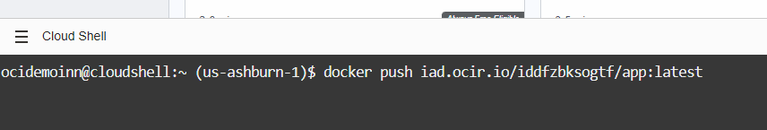
3. Você deverá visualizar um resultado como o abaixo:
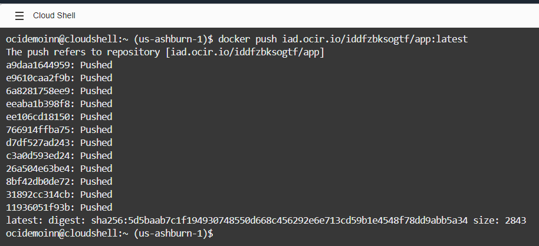

Agora a imagem já está armazenada no seu repositório no OCIR!

## <a name="Passo5"></a>Passo 5: Acesso ao Cluster OKE
Agora iremos acessar o cluster OKE provisionado a partir do Terraform. 

### 1. Selecionando o cluster
1. Na console da OCI, acesse o "menu hambúrguer" e em **Developer Services** clique em **Kubernetes Clusters**.
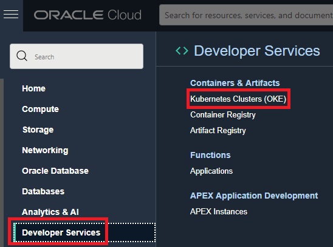
2. Selecione o compartimento que criamos anteriormente e, em seguida, selecione o cluster OKE provisionado.
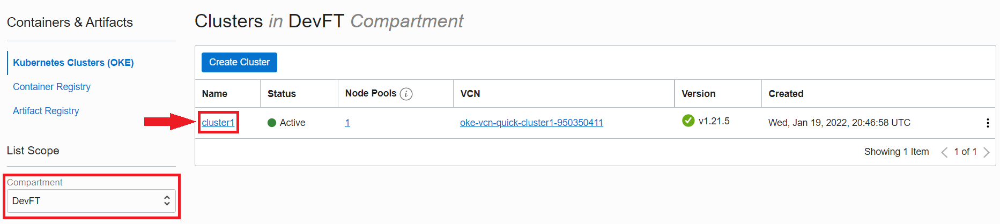

### 2. Configurando o acesso ao cluster
1. Dentro da página do cluster, clique em **Access Cluster**.
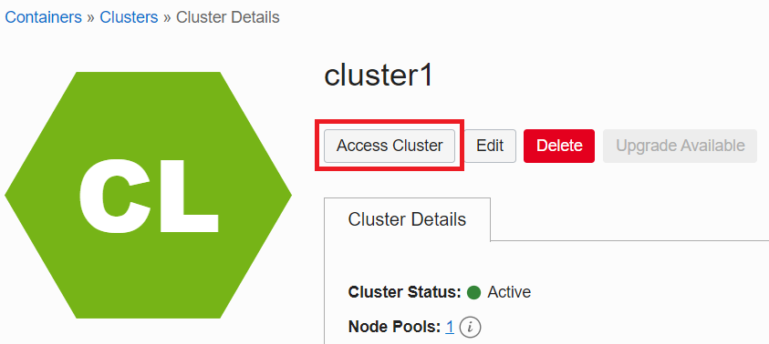
2. Selecione a opção **Cloud Shell Access**.
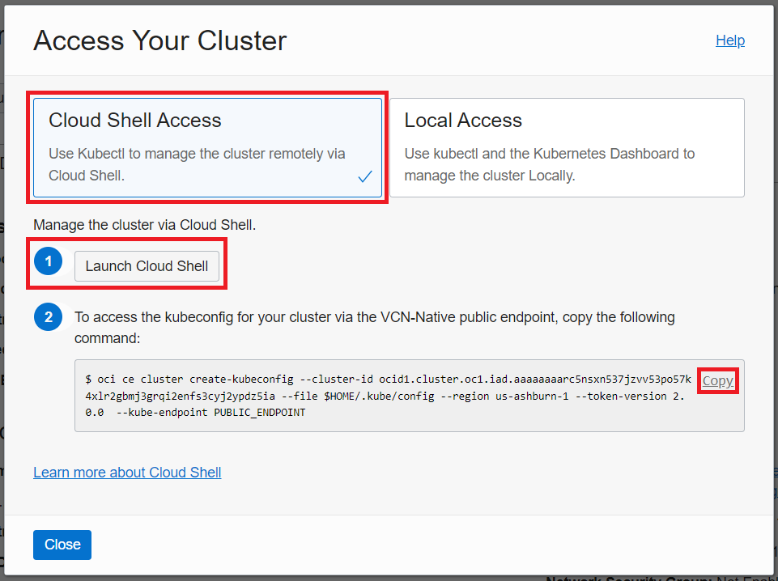
3. Clique em **1 - Launch Cloud Shell** para abrir o Cloud Shell.
4.  Copie o comando em **2**, cole no **Cloud Shell** e execute.
	- Obs: Esse comando configura o arquivo `kubeconfig` e o salva com um nome padrão e na localização `$HOME/.kube/config`. Esse nome e localização garantem que o arquivo `kubeconfig` é acessível ao kubectl sendo executado no Cloud Shell.

### 3. Acessando o cluster 
1. Verifique que você pode usar o `kubectl` para se conectar ao cluster. No **Cloud Shell**, execute o comando:
```python
kubectl get nodes
```
2. Você deve ser capaz de visualizar os detalhes dos nós executando no seu cluster. Como por exemplo:
```python
NAME          STATUS   ROLES   AGE   VERSION
10.0.10.111   Ready    node    10m   v1.21.5
10.0.10.197   Ready    node    10m   v1.21.5
10.0.10.206   Ready    node    10m   v1.21.5
```
Pronto, agora você tem acesso ao cluster OKE e poderá seguir para o próximo passo!

## <a name="Passo6"></a>Passo 6: Criação do Secret
Neste momento, precisamos criar um secret que será utilizado para permitir que o Kubernetes faça o pull da imagem presente no repositório do OCIR. Este secret inclue todos os detalhes de login que você proveria caso estivesse realizando manualmente o login no OCIR usando o comando docker login, incluindo o seu Auth Token.

### 1. Criando o secret 
1. Copie o comando abaixo:
```python
kubectl create secret docker-registry ocirsecret --docker-server=<region-key>.ocir.io --docker-username='<tenancy-namespace>/<oci-username>' --docker-password='<oci-auth-token>' --docker-email='<email-address>'
```
2. O valor "ocirsecret" é o nome que estamos atribuindo ao secret.
3. A  `<region-key>` é _iad_.
4. O  `<tenancy-namespace>` pode ser obtido na console da OCI em **Tenancy -> Object Storage Namespace**.
5. O `<oci-username>` é nome formato: oracleidentitycloudservice/\<email-address>.
6. O `<oci-auth-token>` é o mesmo utilizado no passo 3.
7. O `<email-address>` é o utilizado na sua conta na OCI.
8. Após as alterações, insira no **Cloud Shell** e execute.
9. Verifique se o secret foi criado com sucesso executando o comando:
```python
kubectl get secrets
```
9. Você deve visualizar os detalhes relativos ao segredo `ocirsecret` criado.
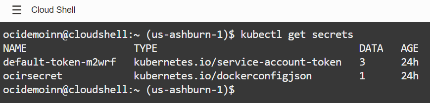

## <a name="Passo7"></a>Passo 7: Aplicação do Manifesto Kubernetes
O manifesto kubernetes é, basicamente, a especificação de um objeto Kubernetes API no formato JSON ou YAML. O manifesto, então, especifica o estado desejado de um objeto que o Kubernetes irá manter quando você aplicar esse manifesto. De forma simplificada, nós iremos usar o manifesto para implementar a nossa aplicação web no cluster OKE. 

### 1. Configuração do Manifesto Kubernetes no Cloud Shell

1. No **Cloud Shell**, vá para o diretório inicial, caso não esteja:
```python
cd $HOME
```
2. Ainda no **Cloud Shell**, no mesmo diretório, crie um novo arquivo de texto com o nome _app.yml_:
```python
vim app.yaml
```
3. Dentro do editor vim, aperte a tecla _i_ do teclado, para acessar o modo de edição.
4. Agora, em um editor de sua preferência, copie e cole o texto abaixo.
```python
apiVersion: apps/v1
kind: Deployment
metadata:
  name: app
spec:
  selector:
    matchLabels:
      app: app
  replicas: 3 
  template:
    metadata:
      labels:
        app: app
    spec:
      containers:
        - name: app
          image: iad.ocir.io/<tenancy-namespace>/<image-tag>
          ports:
            - containerPort: 80
      imagePullSecrets:
        - name: ocirsecret

---

apiVersion: v1
kind: Service
metadata:
  name: svc-app
spec:
  type: LoadBalancer
  selector:
    app: app
  ports:
    - protocol: TCP
      port: 80
```
- Obs: Veja que especificamos um serviço do tipo Load Balancer na linha `type: LoadBalancer`! Ele utilizará o protocolo TCP e a porta 80 para rotear o tráfego de entrada para os nós do cluster, permitindo a comunicação com nossa aplicação web!
6. Lembre-se de substituir o `<tenancy-namespace>` e a `<image-tag>`.
7. Após a edição, cole o texto no editor vim, no **Cloud Shell**, e execute a seguinte sequência:
	1. Aperte a tecla _ESC_.
	2. Digite os três caracteres: _wq!_ e pressione a tecla _ENTER_ para sair da edição, salvando o arquivo.
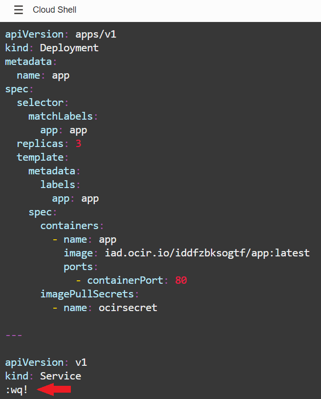

### 2. Aplicação do Manifesto Kubernetes
1. No **Cloud Shell**, para aplicar o manifesto, execute o seguinte comando:
```python
kubectl create -f $HOME/app.yml
```
2. Você deverá visualizar uma mensagem confirmando que a implementação da imagem e do load balancer foram ambos criados.

Parabéns! Agora que temos tudo pronto para podermos acessar nossa aplicação web no próximo passo!

## <a name="Passo8"></a>Passo 8: Acesso à Aplicação Web no Cluster OKE
A nossa aplicação já foi implementada! Agora iremos acessá-la pelo próprio navegador.

1. No **Cloud Shell**, insira o seguinte comando:
```python
kubectl get services
```
2. Você deverá visualizar algo como:
```python
NAME         TYPE           CLUSTER-IP     EXTERNAL-IP      PORT(S)        AGE
kubernetes   ClusterIP      10.96.0.1      <none>           443/TCP        4h
svc-app      LoadBalancer   10.96.112.25   <external-ip>   80:31713/TCP   4h
```
4. No seu navegador, insira o `<external-ip>`, obtido anteriormente :
```python
http://<external-ip>
```
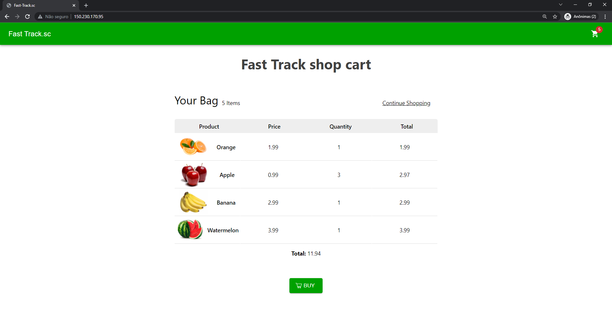

Parabéns! Você conseguiu com sucesso implementar uma aplicação web de e-commerce na OCI!

 O OKE usou o secret que você criou para coletar a imagem do Oracle Cloud Infrastructure Registry (OCIR). Após isso, a imagem passou a ser executada como container e um load balancer foi criado para distribuir as requisições entre os nós do cluster. Ao final, você verificou que tudo está funcionando!


[2 - Using Terraform on OCI <---- ](https://github.com/CeInnovationTeam/Developer-Fast-Track/blob/main/2%20-%20Using%20Terraform%20on%20OCI/Tutorial.md) | [----> 4 - Running a containereized application on OCI](https://github.com/CeInnovationTeam/Developer-Fast-Track/blob/main/4%20-%20Running%20a%20containereized%20application%20on%20OCI/readme.md)
