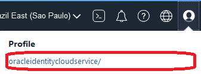
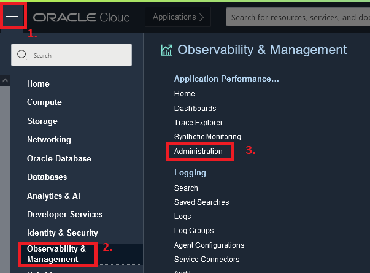
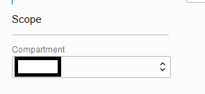
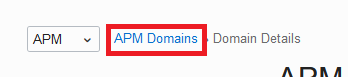
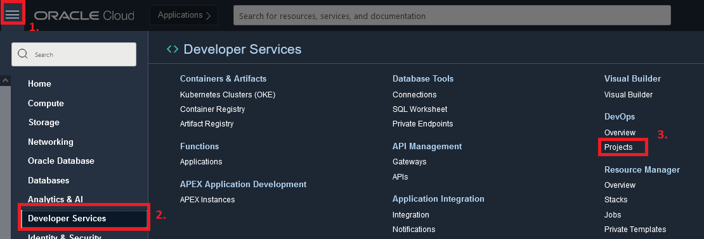
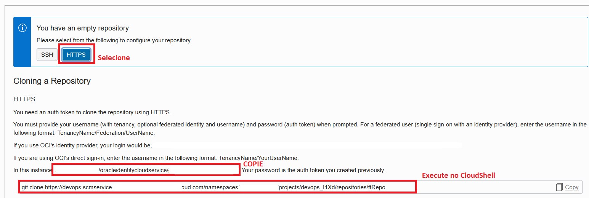

# LAB 4 - Utilizando a plataforma Oracle DevOps para construir uma aplicação containerizada em OCI
**Objetivo deste Lab:**

Nesta etapa construirá uma esteira de desenvolvimento capaz de entregar uma aplicação containerizada, de forma automatizada, a um cluster Kubernetes!

**Você aprenderá todo o passo-a-passo dessa implementação:**
 - [Pre Reqs: Executar terraform de preparação de ambiente, e coletar informações relevantes ao processo](#PreReqs)
 - [Passo 1: Clonar o repositório e movimentar conteúdo para repositório do projeto DevOps](#Passo1)
 - [Passo 2: Criar e configurar processo de Build (CI)](#Passo2)
 - [Passo 3: Criar e configurar entrega de artefatos (CI)](#Passo3)
 - [Passo 4: Criar e configurar entrega de aplicação a cluster kubernetes (CD)](#Passo4)
 - [Passo 5: Configurar gatilho do fluxo e conectar pipelines de CI/CD](#Passo5)
 - [Passo 6: Execução e testes](#Passo6)


 ## <a name="PreReqs"></a> Pre Reqs: Executar terraform de preparação de ambiente, e coletar informações relevantes ao processo

 1. Faça login em sua conta na Cloud. [link](https://www.oracle.com/cloud/sign-in.html) 
 2. Execute o [Laboratório 2](../2%20-%20Using%20Terraform%20on%20OCI/Tutorial.md) deste workshop - *Execute apenas se você não o executou anteriormente*
 3. No canto direito superior, clique no icone de perfil, e clique em seu usuário

 

 4.  No canto esquerdo inferior, clique em **Auth Tokens**, em seguida clique em **Gerar Token**

 

 5. Dê uma descrição ao token, e clique em **Gerar Token**

 

 6. **ATENÇÃO** - Copie o código gerado para um **bloco de notas**, se caso você perder esse código será necessario gera-lo novamente

 
 


 - Durante todo este laboratório, utilizaremos este código quando for solicitada a informação de **Auth Token**


 7. No menu, no canto esquerdo superior acesse: Observabilidade & Gerenciamento > Application Performance > Administração

 
 


 8.  No canto esquerdo inferior, em Escopo, valide se o compartimento correto está selecionado:

  
 


 9. Selecione o Dominio listado: 
   
 

 10. Copie as informações necessárias para o bloco de notas:

    - APM_ENDPOINT: Item 1 da imagem
    - APM_PVDATAKEY: Item 2 da imagem


 11. Retorne a página de dominios

 
 
 12. No canto esquerdo inferior, em Recursos clique em **Download APM Agent**

 
 
 13. **Com o botão direito do mouse** clique no item listado, e selecione **Copiar Link**

 

 - APM_AGENT_URL: Cole o link copiado no bloco de notas 

Com isso cumprimos todos os pré requisitos para o laboratório:

 
 

 ## <a name="Passo1"></a> Passo 1: Clonar o repositório e movimentar conteúdo para repositório do projeto DevOps

 1. Acesse o recurso de cloud shell
 
 


 2. Clone o repositório do projeto 

 ```shell
 git clone https://github.com/CeInnovationTeam/BackendFTDev.git
 ```

 3. Acesse: Menu > Serviços de Desenvolvedor > Devops > Projetos
  
 

 4. Acesse o projeto listado
  
 

 5. Na página do projeto, clique em **Criar repositório**  

 

 6. Preencha o formulário da seguinte forma:

   - Nome: ftRepo
   - Description: (Defina uma descrição qualquer)
   - Branch Default: main

 

 7. Na pagina do repositório recém criado, clique em HTTP e:

    - Copie para o bloco de notas a informação do usuário a ser usado para trabalhar com o git (Referênciaremos esta informação como **Usuário Git**)
    - Execute o comando de git clone no CloudShell

 

 8. No CloudShell, ao executar o comando, informe o **Usuario Git** recém copiado, e o seu **Auth Token** como senha

 9. Neste momento o CloudShell deve possuir dois novos diretórios:
 - BackendFTDev
 - ftRepo
 
 

 10. Execute os seguintes comandos para copiar o conteúdo do repositório BackendFTDev, para o repositório ftRepo

 ```shell
 cp -r BackendFTDev/* ftRepo/
 cd ftRepo
 git add -A
 git commit -m "inicio do projeto"
 git push origin main
 ```

*Ao final do último comando o **Usuário git** e a senha (**Auth Token**) poderão ser solicitados novamente*

 ## <a name="Passo2"></a> Passo 2: Criar e configurar processo de Build (CI)

 1. Retorne a pagina inicial do projeto DevOps
 2. Clique em **Criar pipeline de Build** 

 

 3. Preencha o formulário da seguinte forma, e clique em Criar:
   - Nome: build
   - Descrição: (Defina uma descrição qualquer)

 

 4. Abra o pipeline de build recém criado.
 5. Na aba parametros, defina os seguintes parametros:
  - APM_ENDPOINT: Informação coletada nos pré requisitos
  - APM_PVDATAKEY: Informação coletada nos pré requisitos
  - APM_AGENT_URL: Informação coletada nos pré requisitos.
  *Clique no sinal de "+" para que a informação fique salva*
  
 

 6. Acesse a aba de **Build Pipeline**, e clique em **Add Stage**  

 

 7. Selecione a opção **Managed Build** e clique **Próximo**

 

 8. Preencha o formulário da seguinte forma:

  - Stage Name: Criacao de artefatos
  - Descrição: (Defina uma descrição qualquer)
  - OCI build agent compute shape: (Não alterar)
  - Base container image: (Não alterar)
  - Build spec file path: (Não alterar)
      
    


  - Primary code repository: 
    - Clique no botão **Selecionar** a direita
    - Source Connection type: OCI Code Repository
    - Selecione o repositório **ftRepo**
    - Select Branch: (Não alterar)
    - Build source name: **java_root**
    - Clique em **Save**
    
    


  - Clique em **Criar**

 9. Neste momento é importante entender a forma como a ferramenta trabalha: 
    
- A ferramenta utiliza um documento no formato YAML para definir os passos que devem ser executados durante o processo de construção da aplicação.
- Por padrão este documento é chamado de build_spec.yaml e deve ser configurado previamente de acordo com as necessidades da aplicação
- Os passos serão então executados por uma instância temporária, que será provisionada no inicio de cada execução e destruida ao final do processo.
- Documentação de como formatar o documento de build: https://docs.oracle.com/pt-br/iaas/Content/devops/using/build_specs.htm
- Documento utilizado neste workshop: https://raw.githubusercontent.com/CeInnovationTeam/BackendFTDev/main/build_spec.yaml

 ## <a name="Passo3"></a> Passo 3: Criar e configurar entrega de artefatos (CI)

