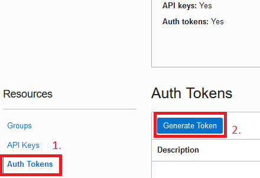
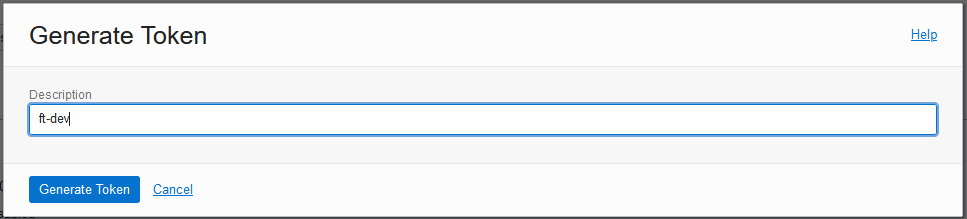
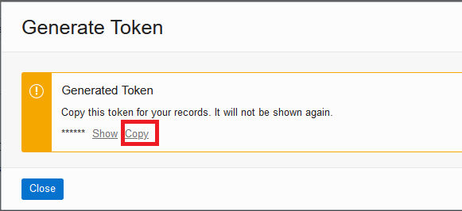

# LAB 4 - Utilizando a plataforma Oracle DevOps para construir uma aplicação containerizada em OCI
**Objetivo deste Lab:**

Nesta etapa construirá uma esteira de desenvolvimento capaz de entregar uma aplicação containerizada, de forma automatizada, a um cluster Kubernetes!

**Você aprenderá todo o passo-a-passo dessa implementação:**
 - [Pre Reqs: Executar terraform de preparação de ambiente, e coletar informações relevantes ao processo](#PreReqs)
 - [Passo 1: Clonar o repositório e movimentar conteúdo para repositório do projeto DevOps](#Passo1)
 - [Passo 2: Criar e configurar processo de construção (CI)](#Passo2)
 - [Passo 3: Criar e configurar entrega de artefatos (CI)](#Passo3)
 - [Passo 4: Criar e configurar entrega de aplicação a cluster kubernetes (CD)](#Passo4)
 - [Passo 5: Configurar gatilho do fluxo e conectar pipelines de CI/CD](#Passo5)
 - [Passo 6: Execução e testes](#Passo6)

 ##  Pre Reqs: Executar terraform de preparação de ambiente, e coletar informações relevantes ao processo

 1. Faça login em sua conta na Cloud. [link](https://www.oracle.com/cloud/sign-in.html) 
 2. Execute o [Laboratório 2](../2%20-%20Using%20Terraform%20on%20OCI/Tutorial.md) deste workshop - *Execute apenas se você não o executou anteriormente*
 3. No canto direito superior, clique no icone de perfil, e clique em seu usuário

 

 4.  No canto esquerdo inferior, clique em **Auth Tokens**, em seguida clique em **Gerar Token**

 

 5. Dê uma descrição ao token, e clique em **Gerar Token**

 

 6. **ATENÇÃO** - Copie o código gerado para um **bloco de notas**, se caso você perder esse código será necessario gera-lo novamente

 
 

 - Durante todo este laboratório, utilizaremos este código quando for solicitada a informação de **Auth Token**