## Lab #4 - Utilizando o API Gateway na OCI
**Objetivo desse Lab:**

Permitir a utilização de uma API pública via API Gateway na OCI.

Para alcançar isso, vamos seguir os seguintes passos:

 - Acessar a console da OCI, no menu lateral esquerdo, em **Developer  Services** -> **API Management** -> **Gateways**.

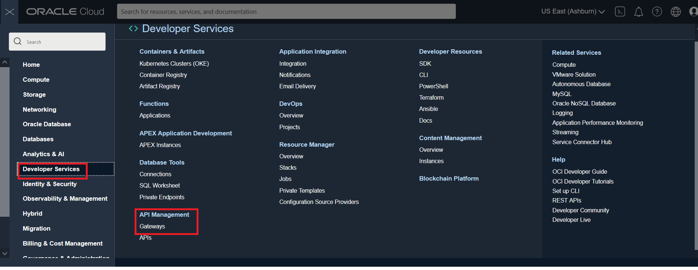 

 - Copie o URL da API pública do IBGE, que iremos utilizar.
```python
https://servicodados.ibge.gov.br/api/v1/localidades/estados/
```

 - Selecione o compartimento criado no projeto e clique na API que está ativa, ao lado.

 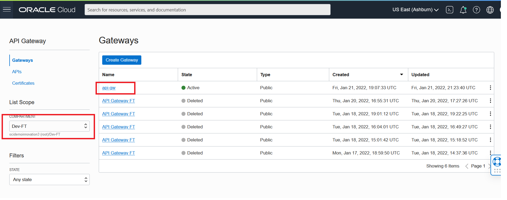
 
 - No canto inferior esquerdo, clique em **Deployments**.

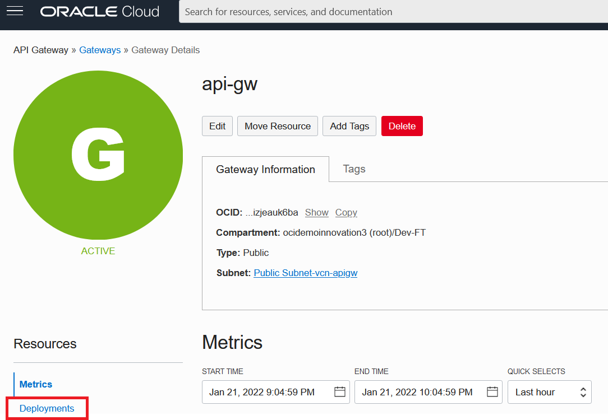

- Clique no botão **Create Deployment**. 

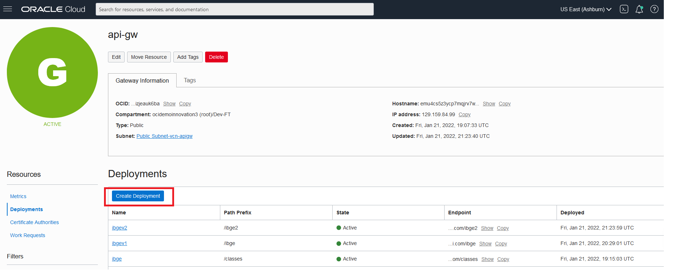

- Na edição das informações básicas, insira os seguintes valores nos campos:
  - name: ibgev1 
  - path prefix: /ibge 
  - compartment: \<seu-compartment>
  - Os demais itens manter no padrão até chegar em API Logging Policies, então selecione a opção _Information_.

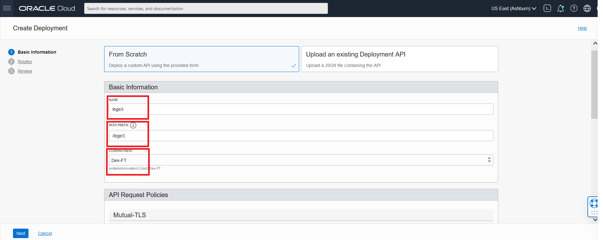
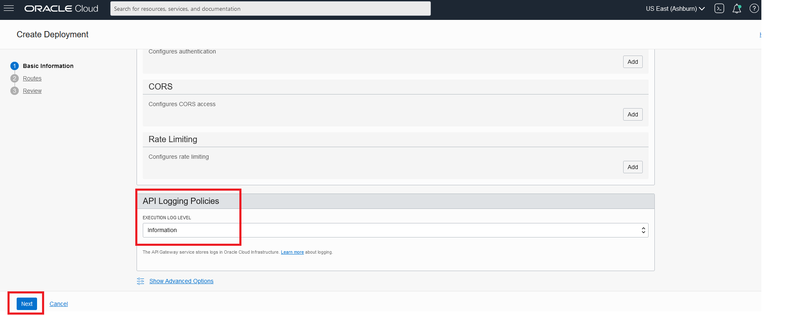

- Clique em **Next**.

- Agora, na edição das rotas, insira os seguintes valores nos campos para a **Route 1**:
  - PATH:  /estados
  - METHODS: GET
  - TYPE: HTTP
  - URL: `https://servicodados.ibge.gov.br/api/v1/localidades/estados/`
 
 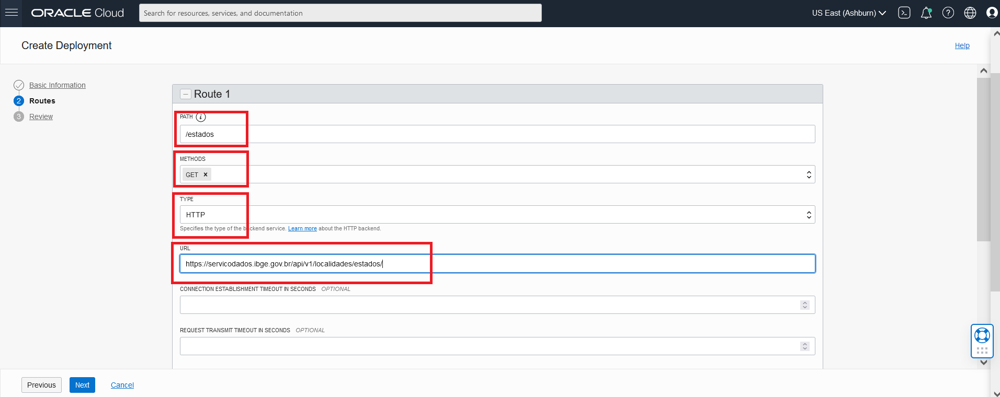

- Desça a tela e clique em **+ Another Route**, para adicionarmos uma nova rota.

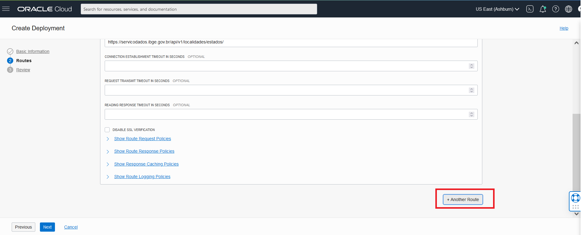

- Então, insira os seguintes valores nos campos para a **Route 2**:

  - PATH:  /stock
  - METHODS: GET
  - TYPE: Stock Response
  - STATUS CODE: 200
  - BODY OPTIONAL: `{"mensagem" "deu bom"}`
  
- Clique em **Next** e, em seguida, clique em **Create**.

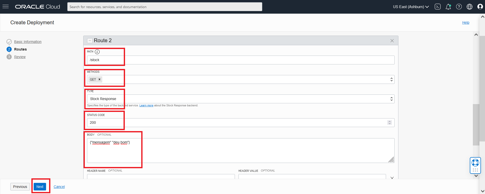
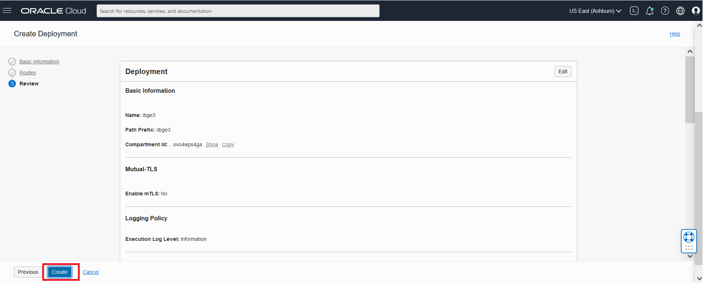

- Enquanto o seu _deployment_ é feito, acesse o **Cloud Shell**, clicando no botão "**(>_)**", no canto superior direito.

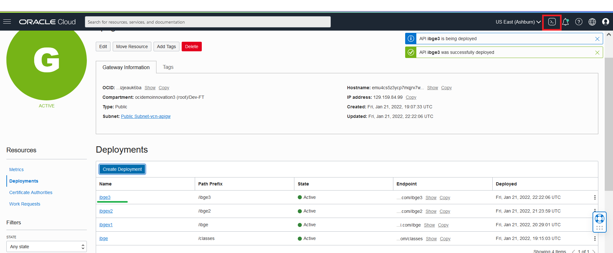

- Em **Deployments**, copie o **endpoint**, do seu deployment (ibgev1), clicando na opção **Copy**.

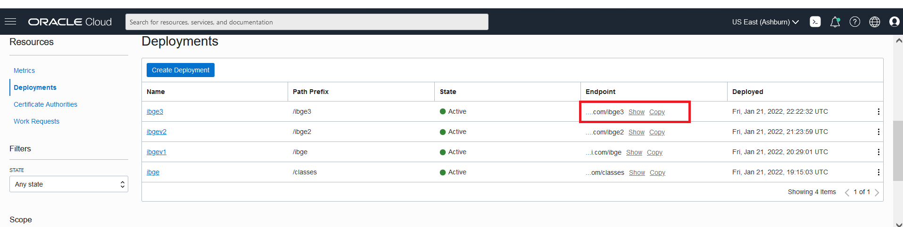

- De volta ao **Cloud shell**, insira o comando:
```python
curl <seu-endpoint>/stock
```
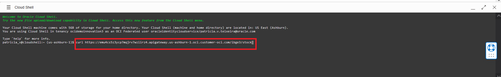

- Ele retornará a mensagem do Body, que inserimos anteriormente!

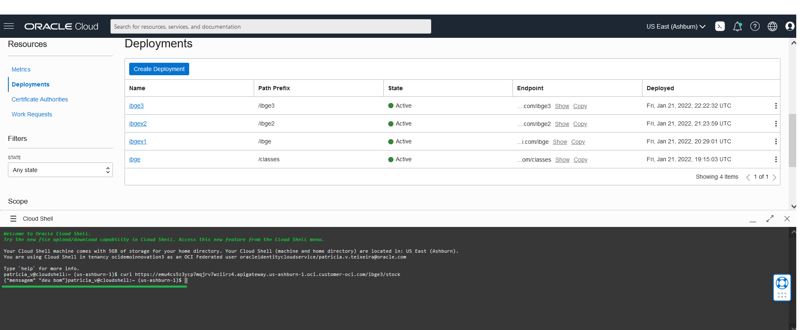

- Agora, para propriamente testar utilizando a API pública, insira o comando:
```python
curl <seu-endpoint>/estados
```

- Ele retornará, no **Cloud Shell**, todos os estados listados na API!

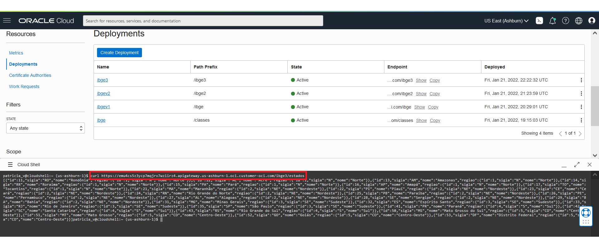

Parabéns! Você aprendeu a criar um API Gateway na OCI e implementar neste a coleta de dados utilizando o método GET uma API pública!