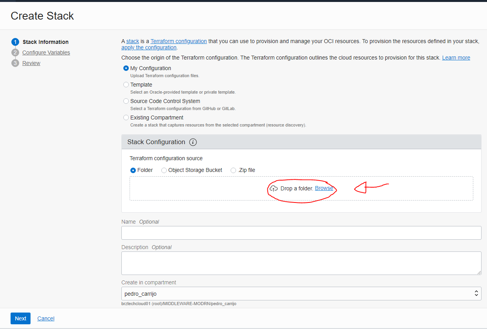

  

# Lab #1 - Using Terraform in OCI


**Lab Objectives:**
  

Provide resources within the OCI using infrastructure as a code.
 
  

**The provisioned resources will be:**

  

  

1. OKE

  

2. DEVOPS

  

3. APM

  

4. API GATEWAY

  

**Together with NETWORK and MANAGEMENT resources such as:**

  

1. VCN

  

2. SUBNETS

  

3. DYNAMIC GROUPS

  

4. COMPARTMENTS

  

  

## 1. Download repository

  

  


- As a first step we need to download this repository from github and for this there are 2 options:

  

  

**1. git clone https://github.com/CeInnovationTeam/DevFT-Terraform.git**

  

  

OR

  

  

**2. download the .zip direct from github**.

  

  


  

  

- Ok, now we have a folder with the terraform codes ready to use, so let's **code a .tf file** to provision an **Oracle API Gateway** along with the other resources already created in this folder.

  

  

## 2. Create a new .tf file

- To create a new terraform file we simply add a new text file with the name **"apigateway.tf "** or any other name but with the extension **".tf "** INSIDE the folder where the other terraform files are.

Exemplo:

  

  


  

 
- Now we add this code below to say that we want to provision an Oracle API Gateway:

  

```

  

resource "oci_apigateway_gateway" "devops_gateway" {

  

compartment_id = var.compartment_id

endpoint_type = var.api_gateway_type

subnet_id = oci_core_subnet.oke_lb_subnet[0].id

display_name = var.api_gateway_name

  

}

  

```

  

In this code we are saying that we want to create a new resource of type **"oci_apigateway_gateway "** and we are setting the necessary infos to configure this resource.

  

  

Source of this code: [Terraform Documentation about API GATEWAY](https://registry.terraform.io/providers/hashicorp/oci/latest/docs/resources/apigateway_gateway)

  

  

- **Having created and populated this .tf file, we can now upload all this infrastructure as code into the OCI**.

  

  

## Uploading terraform into Oracle Resource Manager

  

  

- First of all we must be **logged into the OCI**.

  

- Go to the sandwich menu on the left

  

  


  
  

- Click on "**Developer Services**"

  

  


  
  

- Select  "**Resource Manager**" from the options.

  

  


  
  

- Select and create a new **STACK**.

  

  


  

- Select as source **the folder on your computer containing the downloaded .tf files**, so that the Resource Manager already fills in all the fields.

  

  



  

- Click NEXT and we can check the information about the resources that will be provisioned.

  

- Select a compartment as the first option and the rest will not need to be changed.

  

- Click NEXT.

  

  


  
  

- On this new screen you will be asked to verify the information and click CREATE

  

  


  
  

- Having created our STACK we will now click on PLAN

  

  


  

  


  
  

- After our PLAN is complete, we will now go back to our STACK and click APPLY to actually start provisioning, this will take about 20 minutes.

  

  


  

  


  

  

## Successfully Provisioned Environments!

  

  

- After finishing APPLY successfully, we can check everything that has been created.

  

  

**Provisioned resources:**

  

  

1. OKE

  

2. DEVOPS

  

3. APM

  

4. API GATEWAY

  

**Together with NETWORK and MANAGEMENT resources such as:**

  

1. VCN

  

2. SUBNETS

  

3. DYNAMIC GROUPS

  

4. COMPARTMENTS