# Lab #2 - Deployment of a Web Application Front-End on OCI
**Lab Objective:**

In this step you will deploy the web application front-end on OCI as a container running on a Kubernetes cluster!
**You will learn the entire step-by-step of this deployment:**
 - [Step 1: Cloning the repo using Cloud Shell](#Passo1)
 - [Step 2: Adding the information needed to use Application Performance Monitoring (APM)](#Passo2)
 - [Step 3: Building the Web Application Docker Image](#Passo3)
 - [Step 4: Uploading the Docker Image to OCIR](#Passo4)
 - [Step 5: Accessing the Kubernetes Cluster](#Passo5)
 - [Step 6: Creating a Secret for using the Docker Image from OCIR in the Kubernetes Cluster](#Passo6)
 - [Step 7: Applying the Kubernetes Manifest](#Passo7)
 - [Step 8: Accessing the Web Application](#Passo8)
## <a name="Passo1"></a> Step 1: Cloning the repo using Cloud Shell
1. Log in to your Cloud account. [link](https://www.oracle.com/cloud/sign-in.html)
2. Click the Cloud Shell button in the upper right, next to the region name:
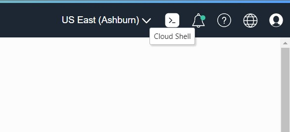
3. Open a new tab in your browser and enter the link: [CeInnovationTeam/FrontFTDev (github.com)](https://github.com/CeInnovationTeam/FrontFTDev)
4. Click on **code** and then copy the repository link.

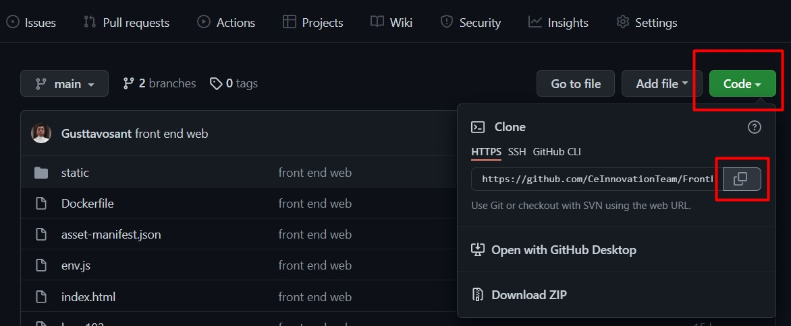

5. Go back to the cloud page and in Cloud Shell type:
	`git clone <repo-link> `

  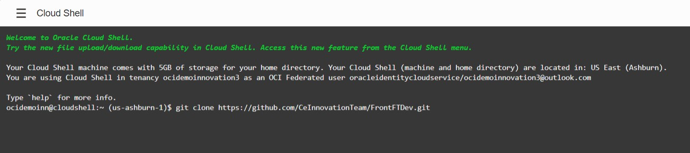

After cloning the repo, we finish the first step!
## <a name="Passo2"></a> Step 2: Adding the information needed to use Application Performance Monitoring (APM)
To use APM in your web application you will need to save some information from your account in the cloud.
1. Click on the side menu, go to Observability & Management and then click on Application Performance Monitoring.

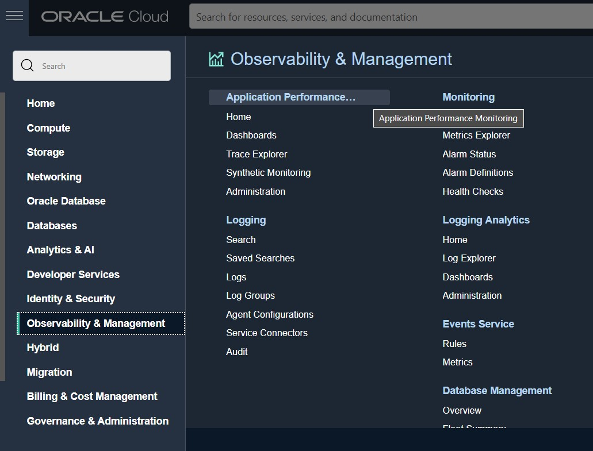

2. Click on the drop box next to home and then on **Administration**.

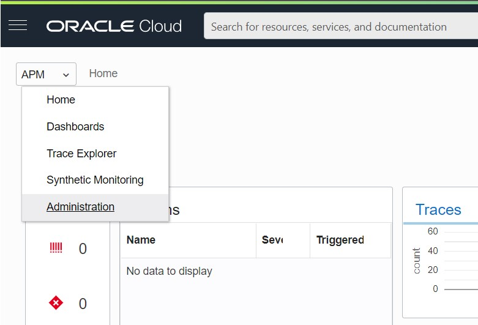

3. Select the Compartment that your applications are in and then select the APM Domain that was created with Terraform.

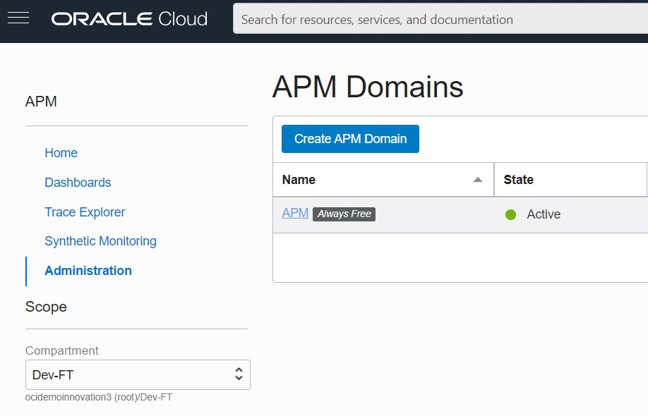

4. Copy the **Data Upload Endpoint** and **auto_generated_public_datakey** into a notepad.

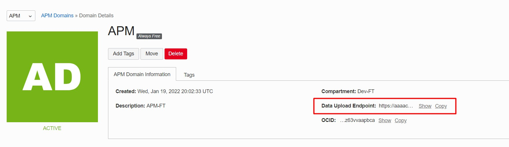


5. Copy the contents of the block below into another notepad and change the fields:
	- < ociDataUploadEndpoint > add the **Data Upload Endpoint** copied in the previous steps.
	- < APM_Public_Datakey > add the **auto_generated_public_datakey** copied in the previous steps.
	- src="< **ociDataUploadEndpoint** >/static/jslib/apmrum.min.js"> add the **Data Upload Endpoint** copied in the previous steps.
```javascript
<script>
window.apmrum = (window.apmrum || {});
window.apmrum.serviceName='APM-Service';
window.apmrum.webApplication='App';
window.apmrum.ociDataUploadEndpoint='<ociDataUploadEndpoint>';
window.apmrum.OracleAPMPublicDataKey='<APM_Public_Datakey>';
</script>
<script async crossorigin="anonymous" src="<ociDataUploadEndpoint>/static/jslib/apmrum.min.js"></script>
```
6. In Cloud Shell, add the command to enter the project folder that was cloned on GitHub:
- `cd FrontFTDev`
To list the files in the folder:
- `ls `

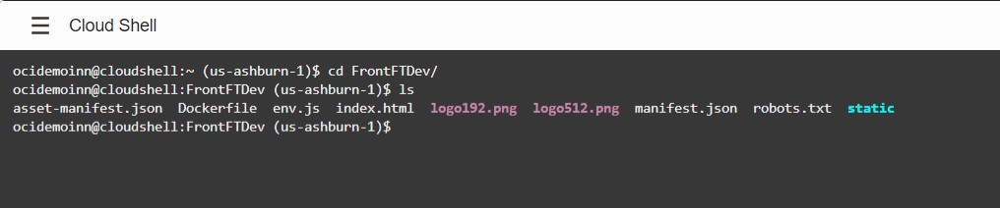
To edit the html file and add the scripts you edited in the previous step:
- `vim index.html`

7. Press the **"i"** key to edit the file, scroll to the end of the </body tag > press **Enter** and paste the edited scripts you copied from your notepad:
8. Press **Esc** and then type "**:wq!**" to save the file

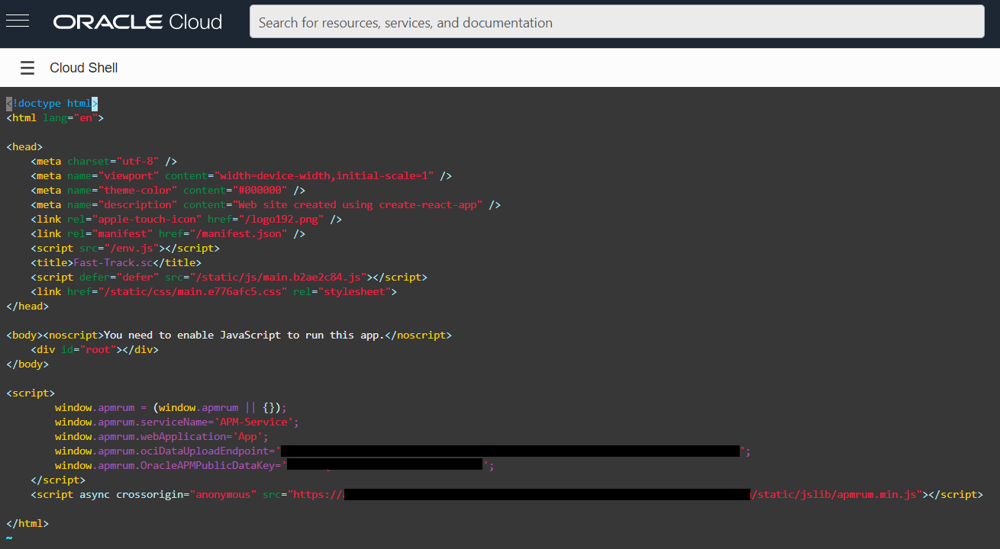

After finishing it, we complete the second step!

## <a name="Passo3"></a> Step 3: Building the Web Application Docker Image
1. Click the profile icon in the upper right corner, click Tenancy: YourTenacyName.
2. Upon entering you will see some information about your Tenancy, copy what is in the **Object Storage Namespace** field into a notepad.
3. In Cloud Shell, add the commands:
- `docker build -t app:latest .`
To build your application image:
- `docker tag app:latest <region-key>.ocir.io/<tenancy-namespace>/app:latest`
- Change the `<region-key>` to your region's reference code **composed of 3 letters**. For reference, use the [Reference Table](https://docs.oracle.com/en-us/iaas/Content/General/Concepts/regions.htm)
- Change the `<tenancy-namespace>` to the name you copied into your notepad.


## <a name="Passo4"></a> Step 4: Uploading the Docker Image to OCIR
At this point, it is necessary to upload the built image to the repository in OCIR.

1. For this, we first need to obtain an Auth Token, which will allow us to perform docker commands. In the console, click the **Profile button** in the upper right corner. Then click on the **first option**.
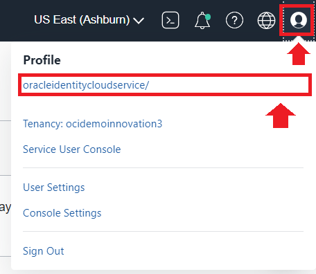
2. In the lower left corner, under **Resources**, click on **Auth Tokens** and the **Generate Token** button.
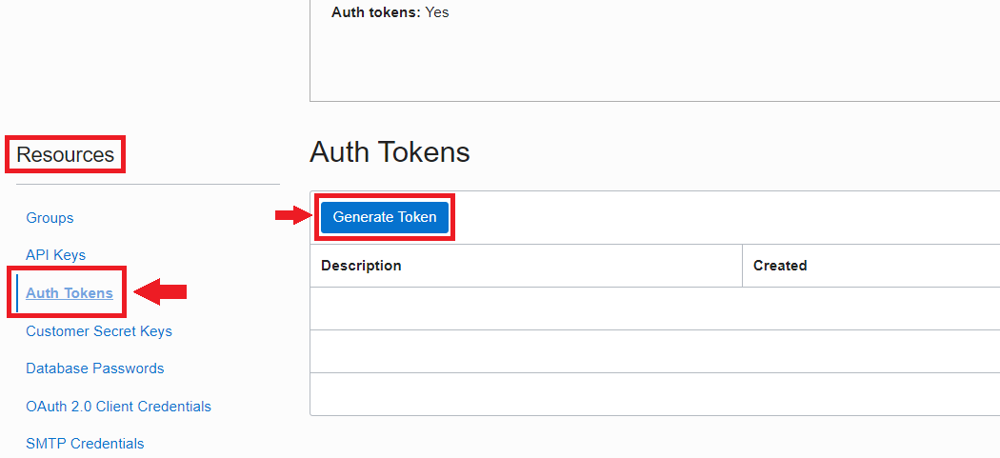
3. Enter a description and click **Generate Token**.
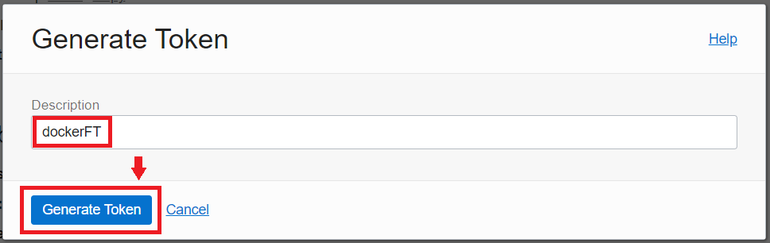
4. Remember to copy the Auth Token to a notebook as you will not have access to it again.
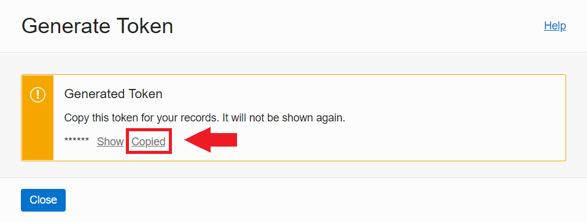
5. So, in the **Cloud Shell**, initially, run the command `docker login`, replacing the `<tenancy-namespace>`, the `<email>` and `<region-key>`:
```python
docker login -u '<tenancy-namespace>/oracleidentitycloudservice/<e-mail>' <region-key>.ocir.io
```
6. The Password requested will be your Auth Token, obtained earlier.

7. Then run the `docker push` command, to push the image to the repository in OCIR:
```python
docker push <region-key>.ocir.io/<tenancy-namespace>/app:latest
```
8. The information for `<tenancy-namespace>` and `<region-key>` was collected in [Step 3](#Passo3).
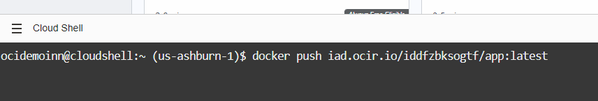
9. You should see a result like the one below:
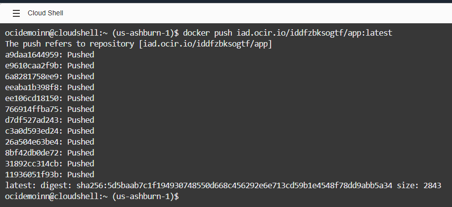

Now the image is already stored in your repository on OCIR!

## <a name="Passo5"></a>Step 5: Accessing the Kubernetes Cluster
Now we will access the OKE cluster provisioned from Terraform.

### 1. Selecting the cluster
1. In the OCI console, access the "hamburger menu" and under **Developer Services** click on **Kubernetes Clusters**.
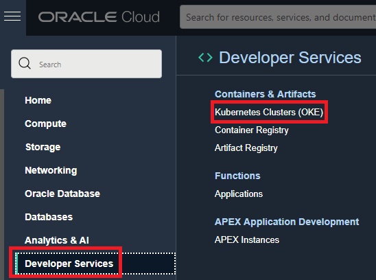
2. Select the compartment we created earlier and then select the provisioned OKE cluster.
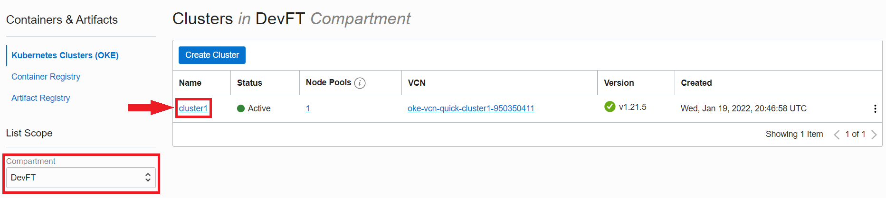

### 2. Configuring cluster access
1. Within the cluster page, click on **Access Cluster**.
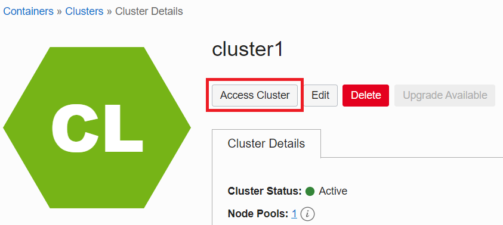
2. Select the **Cloud Shell Access** option.
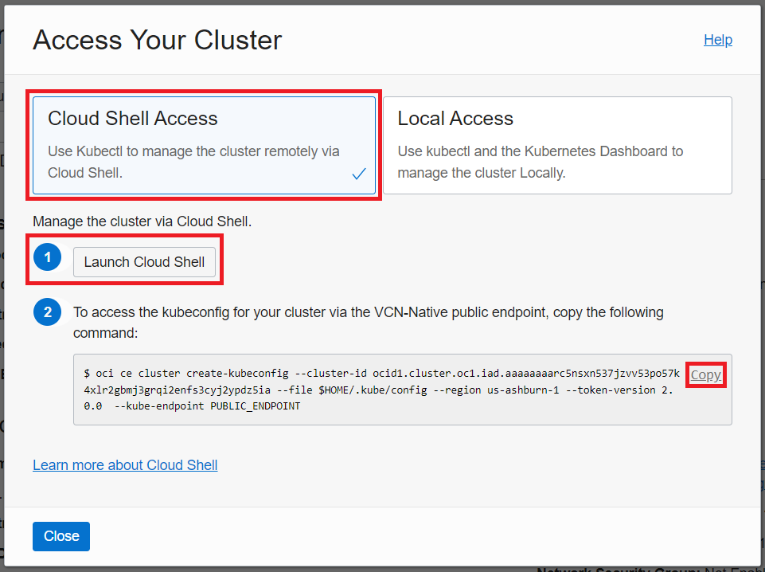
3. Click **1 - Launch Cloud Shell** to open Cloud Shell.
4. Copy the command in **2**, paste in **Cloud Shell** and run.
	- Note: This command configures the `kubeconfig` file and saves it with a default name and in the `$HOME/.kube/config` location. This name and location ensure that the `kubeconfig` file is accessible to kubectl running in Cloud Shell.

### 3. Accessing the cluster
1. Check that you can use `kubectl` to connect to the cluster. In the **Cloud Shell**, run the command:
```python
kubectl get nodes
```
2. You should be able to view the details of the nodes running in your cluster. For example:
```python
NAME          STATUS   ROLES   AGE   VERSION
10.0.10.111   Ready    node    10m   v1.21.5
10.0.10.197   Ready    node    10m   v1.21.5
10.0.10.206   Ready    node    10m   v1.21.5
```
Ok! Now you have access to the OKE cluster and you can move on to the next step!

## <a name="Passo6"></a>Step 6: Creating a Secret for using the Docker Image from OCIR in the Kubernetes Cluster
At this point, we need to create a secret that will be used to allow Kubernetes to pull the image from the OCIR repository. This secret includes all the login details you would provide if you were manually logging into OCIR using the docker login command, including your Auth Token.

### 1. Criando o secret 
1. Copy the command below:
```python
kubectl create secret docker-registry ocir --docker-server=<region-key>.ocir.io --docker-username='<tenancy-namespace>/<oci-username>' --docker-password='<oci-auth-token>' --docker-email='<email-address>'
```
2. The value "ocir" is the name we are giving the secret.
3. The  `<region-key>` is _iad_.
4. The  `<tenancy-namespace>` can be obtained from the OCI console at **Tenancy -> Object Storage Namespace**.
5. The `<oci-username>` is on the format: oracleidentitycloudservice/\<email-address>.
6. The `<oci-auth-token>` is the same used in step 3.
7. The `<email-address>` is the one used in your OCI account.
8. After the changes, insert into the **Cloud Shell** and run.
9. Check if the secret was created successfully by running the command:
```python
kubectl get secrets
```
9. You should see the details regarding the created `ocir` secret.
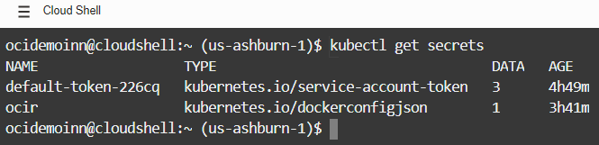

## <a name="Passo7"></a>Step 7: Applying the Kubernetes Manifest
The Kubernetes manifest is basically the specification of a Kubernetes API object in JSON or YAML format. The manifest then specifies the desired state of an object that Kubernetes will maintain when you apply that manifest. Simply put, we will use the manifest to deploy our web application to the OKE cluster.

### 1. Configuring Kubernetes Manifest in Cloud Shell

1. 1. In **Cloud Shell**, go to your home directory, if you're still not:
```python
cd $HOME
```
2. Still in the **Cloud Shell**, in the same directory, create a new text file with the name _app.yml_:
```python
vim app.yml
```
3. Inside the vim editor, press the _i_ key on the keyboard to access the edit mode.
4. Now, in an editor of your choice, copy and paste the text below.
```python
apiVersion: apps/v1
kind: Deployment
metadata:
  name: app
spec:
  selector:
    matchLabels:
      app: app
  replicas: 3 
  template:
    metadata:
      labels:
        app: app
    spec:
      containers:
        - name: app
          image: iad.ocir.io/<tenancy-namespace>/<image-tag>
          ports:
            - containerPort: 80
      imagePullSecrets:
        - name: ocir

---

apiVersion: v1
kind: Service
metadata:
  name: svc-app
spec:
  type: LoadBalancer
  selector:
    app: app
  ports:
    - protocol: TCP
      port: 80
```
- Note: Note that we specify a Load Balancer type service in the `type: LoadBalancer` line! It will use TCP protocol and port 80 to route incoming traffic to cluster nodes, allowing communication with our web application!
6. Remember to replace the `<tenancy-namespace>` and the `<image-tag>`, which in our case is _app:latest_.
7. After editing, paste the text in the vim editor, in the **Cloud Shell**, and execute the following sequence:
	1. Press the _ESC_ key.
	2. Type the three characters: _wq!_ and press the _ENTER_ key to exit editing, saving the file.
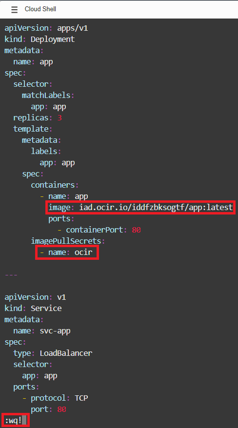

### 2. Application of the Kubernetes Manifest
1. In the **Cloud Shell**, to apply the manifest, run the following command:
```python
kubectl create -f $HOME/app.yml
```
2. You should see a message confirming that the image and load balancer deployment were both created.

Congratulations! Now that we have everything ready so we can access our web application in the next step!

## <a name="Passo8"></a>Step 8: Accessing the Web Application
Our application has already been implemented! Now we will access it from the browser itself.

1. In the **Cloud Shell**, enter the following command:
```python
kubectl get services
```
2. You should see something like:
```python
NAME         TYPE           CLUSTER-IP     EXTERNAL-IP      PORT(S)        AGE
kubernetes   ClusterIP      10.96.0.1      <none>           443/TCP        4h
svc-app      LoadBalancer   10.96.112.25   <external-ip>   80:31713/TCP   4h
```
3. In your browser, enter the `<external-ip>`, obtained earlier:
```python
http://<external-ip>
```
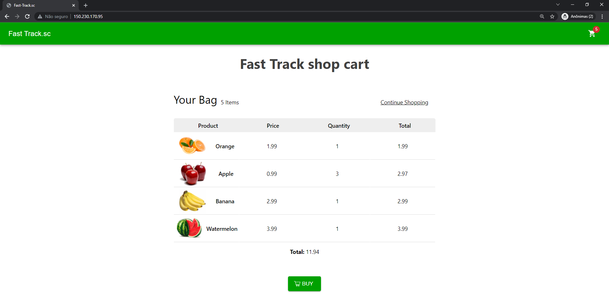

Congratulations! You have successfully implemented an e-commerce web application at OCI!

OKE used the secret you created to collect the Oracle Cloud Infrastructure Registry (OCIR) image. After that, the image started to be executed as a container and a load balancer was created to distribute the requests between the cluster nodes. In the end, you verified that everything is working!


[2 - Using Terraform on OCI <---- ](https://github.com/CeInnovationTeam/Developer-Fast-Track/blob/main/2%20-%20Using%20Terraform%20on%20OCI/Tutorial.md) | [----> 4 - Running a containereized application on OCI](https://github.com/CeInnovationTeam/Developer-Fast-Track/blob/main/4%20-%20Running%20a%20containereized%20application%20on%20OCI/readme.md)