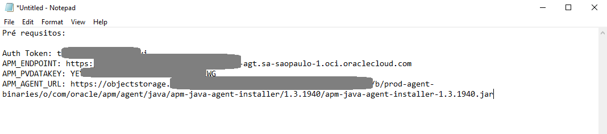
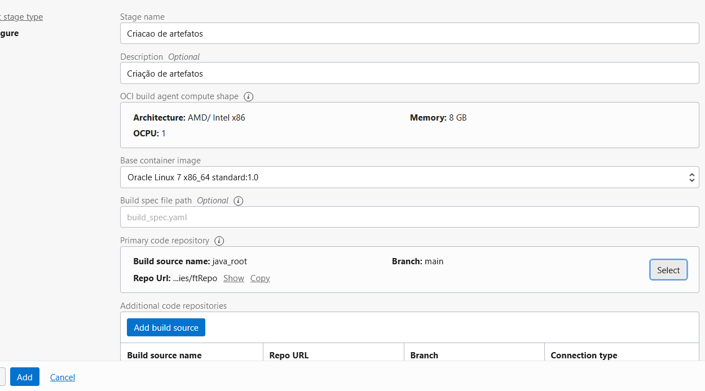
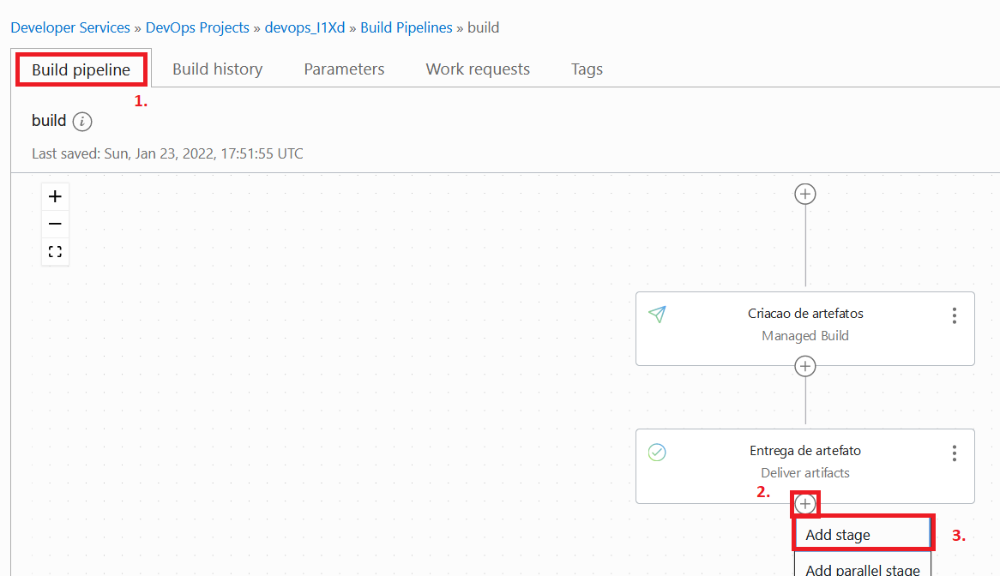
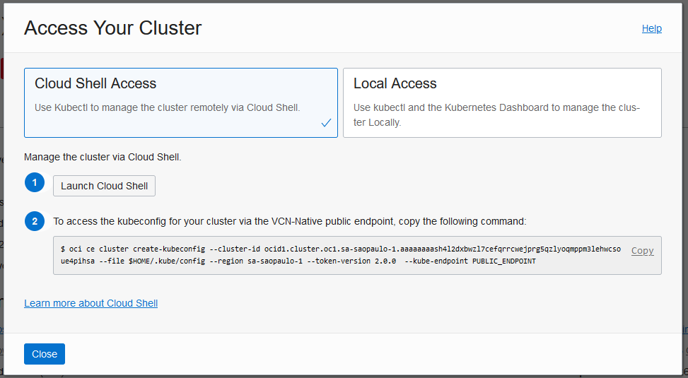
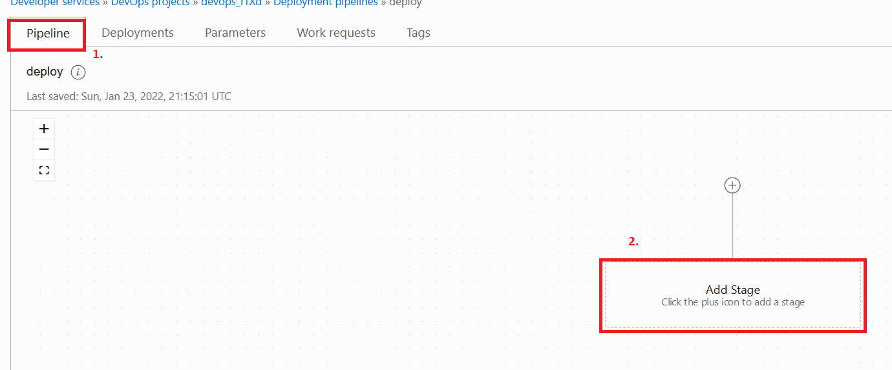
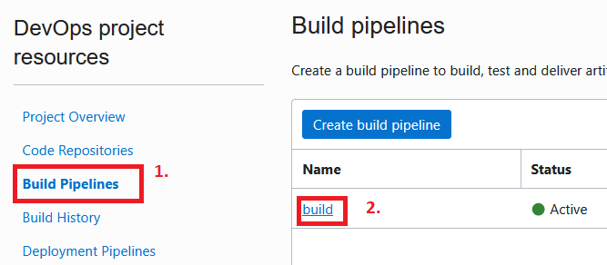
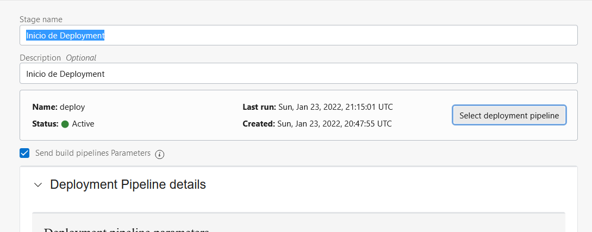
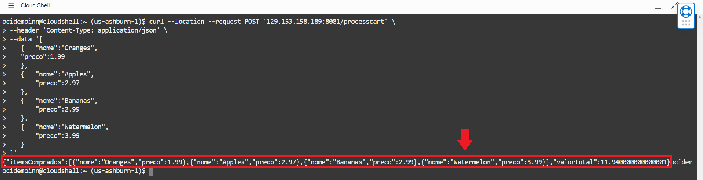

# LAB 4 - Using the Oracle DevOps platform to build a containerized application on OCI 
**Lab Objective:**
In this step, you will build a development pipeline capable of delivering a containerized application, in an automated way, to a Kubernetes cluster!
  
**You will learn the entire step-by-step of this implementation:**
- [LAB 4 - Using the Oracle DevOps platform to build a containerized application on OCI](#lab-4---using-the-oracle-devops-platform-to-build-a-containerized-application-on-oci)
  - [<a name="PreReqs"></a> Pre Reqs: Perform Terraform environment preparation and collect process-relevant information](#-pre-reqs-perform-terraform-environment-preparation-and-collect-process-relevant-information)
  - [<a name="Passo1"></a> Step 1: Clone the repository and move content to the DevOps project repository](#-step-1-clone-the-repository-and-move-content-to-the-devops-project-repository)
  - [<a name="Passo2"></a> Step 2: Create and Configure Build Process (CI)](#-step-2-create-and-configure-build-process-ci)
  - [<a name="Passo3"></a> Step 3: Create and Configure Artifact Delivery (CI)](#-step-3-create-and-configure-artifact-delivery-ci)
  - [<a name="Passo4"></a> Step 4: Create and Configure Application Delivery to a Kubernetes Cluster (CD)](#-step-4-create-and-configure-application-delivery-to-a-kubernetes-cluster-cd)
  - [<a name="Passo5"></a> Step 5: Configure Flow Trigger and Connect CI/CD Pipelines](#-step-5-configure-flow-trigger-and-connect-cicd-pipelines)
  - [<a name="Passo6"></a> Step 6: Execution and testing](#-step-6-execution-and-testing)
  
  
## <a name="PreReqs"></a> Pre Reqs: Perform Terraform environment preparation and collect process-relevant information
  
1. Log in to your Cloud account. [link](https://www.oracle.com/cloud/sign-in.html)
2. Run [Laboratory 2](../2%20-%20Using%20Terraform%20on%20OCI) from this workshop - *Run only if you have not run it before*.
3. In the upper right corner, click the profile icon, and click your username.
  

  
4. In the lower left corner, click on **Auth Tokens**, then click on **Generate Token**.
  

  
5. Give the token a description, and click **Generate Token**.
  

  
6.  **ATTENTION** - Copy the generated code to a **notepad**, if you lose this code it will be necessary to generate it again.
  

  
  
- Throughout this lab, we will use this code when prompted for **Auth Token** information.
  
  
  
7. In the menu, in the upper left corner, access: Observability & Management > Application Performance > Administration
  

  
  
8. In the lower left corner, under Scope, validate that the correct compartment is selected:
  

  
  
9. Select the Domain listed:


  
10. Copy the necessary information into a notepad:
  
- APM_ENDPOINT: Item 1 of the image
- APM_PVDATAKEY: Item 2 of the image
  

  
11. Return to domains page.
  

12. In the lower left corner, under Resources click on **Download APM Agent**
  

13.  **Right-click** on the item listed, and select **Copy Link**
  

  
- APM_AGENT_URL: Paste the copied link into the Notepad
  
With this we fulfill all the prerequisites for the laboratory:
  

  
## <a name="Passo1"></a> Step 1: Clone the repository and move content to the DevOps project repository
  
1. Access the cloud shell feature.

  
  
2. Clone the project repository
  
```shell
git clone https://github.com/CeInnovationTeam/BackendFTDev.git
```
  
3. Access: Menu > Developer Services > Devops > Projects.

  
4. Access the project listed.

  
5. On the project page, click **Create repository**.
  

  
6. Fill in the form as follows:
  
- Name: ftRepo
- Description: (Defina uma descrição qualquer)
- Branch Default: main
  

  
7. On the newly created repository page, click HTTP and:
  
- Copy the user information to be used to work with git into Notepad (We will refer to this information as **Git User**)
- Run the git clone command in Cloud Shell.
  

  
8. In CloudShell, when executing the command, enter the **Git User** just copied, and your **Auth Token** as password
  
9. At this point, Cloud Shell should have two new directories:
- BackendFTDev
- ftRepo

  
10. Run the following commands to copy the contents of the BackendFTDev repository to the ftRepo repository
  
```shell
git config --global user.email "<your-email>"
git config --global user.name "<your-username>"
cp -r BackendFTDev/* ftRepo/
cd ftRepo
git add -A
git commit -m "start of the project"
git push origin main
```
  
*At the end of the last command the **Git User** and password (**Auth Token**) may be requested again*
  
## <a name="Passo2"></a> Step 2: Create and Configure Build Process (CI)
  
1. Return to the DevOps project homepage
2. Click on **Create Build Pipeline**
  

  
3. Fill in the form as follows, and click Create:
- Name: build
- Description: (Define any description)
  

  
4. Open the newly created build pipeline.
5. On the parameters tab, set the following parameters:
- APM_ENDPOINT: Information collected in prerequisites
- APM_PVDATAKEY: Information collected in prerequisites
- APM_AGENT_URL: Information collected in prerequisites
*Click on the "+" sign to save the information*

  
6. Access the **Build Pipeline** tab, and click on **Add Stage**
  

  
7. Select the **Managed Build** option and click **Next**
  

  
8.Fill in the form as follows:
  
- Stage Name: Artifact creation
- Description: (Define any description)
- OCI build agent compute shape: (Do not change)
- Base container image: (Do not change)
- Build spec file path: (Do not change)

  
  
- Primary code repository:
- Click on the **Select** button on the right
- Source Connection type: OCI Code Repository
- Select the **ftRepo** repository
- Select Branch: (Do not change)
- Build source name: **java_root**
- Click **Save**

  
  
- Click **Create**
  
9. At this point it is important to understand how the tool works:
- The tool uses a document in YAML format to define the steps that must be performed during the application construction process.
- By default this document is called build_spec.yaml and must be configured in advance according to the application's needs.
- The steps will then be executed by a temporary instance, which will be provisioned at the beginning of each execution and destroyed at the end of the process.
- Documentation on how to format the build document: https://docs.oracle.com/en-us/iaas/Content/devops/using/build_specs.htm
- Document used in this workshop: https://raw.githubusercontent.com/CeInnovationTeam/BackendFTDev/main/build_spec.yaml
  
## <a name="Passo3"></a> Step 3: Create and Configure Artifact Delivery (CI)
  
1. In the Build Pipeline tab, click on the **"+"** sign below the **Artifact Creation** and **Add Stage**

  
  
2. Click **Deliver Artifacts** and **Next**

  
  
3. Fill in the form as follows:
- Stage name: Artifact delivery
- Description: (Define any description)
- Select **Create Artifact**
- Name: backend_jar
- Type: General Artifact
- Artifact registry: Select the Terraform-generated Artifact Record named "artifact_repository"
- Artifact location: Set a Custom artifact location and version
- Artifact path: backend.jar
- Version: ${BUILDRUN_HASH}
- Replace parameters used in this artifact: Yes, substitute placeholders
- Click add

  
  
- Fill the remaining field of the **Build config/result artifact name** table with: app

  
  
4. Click **Add**
5. In the Build Pipeline tab, click on the **"+"** sign below the stage **Artifact delivery** and **Add Stage**
6. Click **Deliver Artifacts** and **Next**

  
7. Fill in the form as follows:
- Stage name: Container Image Delivery
- Description: (Define any description)
- Select **Create Artifact**
- Name: backend_img
- Type: Container image repository
- Artifact Source: `<region-code>.ocir.io/${IMG_PATH}`
*for the reference code of your region **consisting of 3 letters**, use the [Reference Table](https://docs.oracle.com/en-us/iaas/Content/General/Concepts/regions.htm)*

  
  
- Fill the remaining field of the **Build config/result artifact name** table with: docker-img

  
8. Click **Add**
9. Duplicate your browser tab and access OCIR.
10. In the new compartment created, click on **Create Repository**.

  
11. In _Repository name_, enter the name "java-img" and click **Create Repository**.


  
  
12. Return to the OCI DevOps tab and, in the upper right corner, click on **Start Manual Run**.

  
This concludes the Build step of the project! Here, we've automated the compilation of the java code, created the container image, and stored both in the artifact and container repositories respectively.
  
## <a name="Passo4"></a> Step 4: Create and Configure Application Delivery to a Kubernetes Cluster (CD)
  
1. Go to: Menu > Developer Services > Kubernetes Clusters

  
2. Select the cluster listed

  
3. Click on **Access Cluster**

  
4. Perform steps 1 and 2 of the guide

  
5. Test your connection to the cluster by running:
  
```shell
kubectl get nodes
```
  
6. If you don't yet have a secret, run the commands below:
  
```shell
cd ftRepo/scripts/
chmod +x create-secret.sh
./create-secret.sh
```
  
7. Enter your User OCID (https://docs.oracle.com/en-us/iaas/Content/API/Concepts/apisigningkey.htm#five)
8. In the password field, enter the **Auth Token**.
9. Wait for the end of the stream.

  
10. Return to the project: Menu > Developer Services > DevOps > Projects, and select the project for this workshop.
11. In the left corner, select **Environments**

  
12. Click on **Create New Environment**

  
13. Fill in the form as follows:
- Environment type: Oracle Kubernetes Engine
- Name: OKE
- Description: OKE
14. Click **Next**.
15. Select the Kubernetes Cluster, and click **Create Envrinoment**.
16. In the left corner select **Artifacts** then **Add Artifact**.

  
17. Fill in the form as follows:
- Name: deployment.yaml
- Type: Kubernetes manifest
- Artifact Source: Inline
- Value: Paste the contents of the file https://github.com/CeInnovationTeam/BackendFTDev/blob/main/scripts/deployment.yaml
*Do not change the indentation (spaces) of the document, as this may break it.*
- Replace parameters used in this artifact: Yes, substitute placeholders
- Click **Add**

  
18. In the left corner, select **Developer Pipelines** then click on **Create Pipeline**

  
19. Fill in the form as follows:
- Pipeline name: deploy
- Description: (Define any description)
- Click **Create**

  
20. In the **Parameters** tab, configure the following parameter:
- REGISTRY_REGION: `<region-code>`.ocir.io
*for the reference code of your region **consisting of 3 letters**, use the [Reference Table](https://docs.oracle.com/en-us/iaas/Content/General/Concepts/regions.htm)*

  
21. Return to the **Pipeline** tab and click on **Add Stage**

  
22. Select the **Apply Manifest to your Kubernetes Cluster** Option and click **Next**

  
23. Fill in the form as follows:
- Name: **Application Deployment**
- Description: (Define any Description)
- Environment: OKE
- Click **Select Artifact** and select **deployment.yaml**
- Click **Add**

  
With this we finish the deployment part (CD)! In the next step we will connect both pipelines, and define a trigger for the automated process to start.
## <a name="Passo5"></a> Step 5: Configure Flow Trigger and Connect CI/CD Pipelines
  
1. Return to the project: Menu > Developer Services > DevOps > Projects, and select the project for this workshop
2. In the left corner select **Triggers** and then **Create Trigger**

3. Fill in as follows:
- Name: Start
- Description: (Define any description)
- Source connection: OCI Code Repository
- Select code repository: ftRepo
- Actions: Add Action
- Pipeline: build
- Event: Push
- Source branch: main
- Click **Save**
- Click **Create**

  
From that moment on, any new push made to the project repository will start the build pipeline created in this workshop.
  
4. Return to the project's build pipeline configuration by selecting **Build Pipelines**, **build**
  

  
5. In the Build Pipeline tab, click on the **"+"** sign below the **Container Image Delivery** and **Add Stage**
  

  
6. Select the **Trigger Deployment** item, and click **Next**
  

  
7. Fill in the form as follows:
- Name: Deployment Start
- Description: (Define any description)
- Select deployment pipeline: deploy
- Keep the other fields unchanged, and click **Add**.
  

  
Congratulations!! You have successfully built your first DevOps pipeline within Oracle Cloud!! The next step is directed to project validation.
  
## <a name="Passo6"></a> Step 6: Execution and testing
In this step we will validate the execution of the project
1. Return to the project: Menu > Developer Services > DevOps > Projects, and select the project for this workshop
2. Return to the project's build pipeline configuration by selecting **Build Pipelines**, **build**

  
3. In the upper left corner, select **Start Manual Run**.
4. Keep the default form information, and click **Start Manual Run**.
5. Wait for the flow to run.
6. Access Cloud Shell again and run the command
  
```shell
kubectl get svc
```
  
7. Copy the EXTERNAL-IP information from the _svc-java-app_ service as it becomes available.
  
```shell
NAME TYPE CLUSTER-IP EXTERNAL-IP PORT(S) AGE
kubernetes ClusterIP 10.96.0.1 <none> 443/TCP 30h
svc-app LoadBalancer 10.96.252.115 <svc-app-ip> 80:31159/TCP 29h
svc-java-app LoadBalancer 10.96.16.229 <EXTERNAL-IP> 8081:32344/TCP 103m
```
  
8. Run the command below replacing the information of <EXTERNAL-IP> with the copied IP
```shell
curl --location --request POST '<EXTERNAL-IP>:8081/processcart' \
--header 'Content-Type: application/json' \
--data '[
{ "nome":"Oranges",
"preco":1.99
},
{ "nome":"Apples",
"preco":2.97
},
{ "nome":"Bananas",
"preco":2.99
},
{ "nome":"Watermelon",
"preco":3.99
}
]'
```
- You should see the following response:
  

  
Congratulations on completing this lab on OCI DevOps!