## Lab #4 - Using the API Gateway in OCI

**Lab objectives:**

Enable the use of a public API via API Gateway in OCI.

To achieve this, we will follow the following steps: 

- Access the OCI console, on the left side menu, under **Developer Services** -> **API Management** -> **Gateways**.

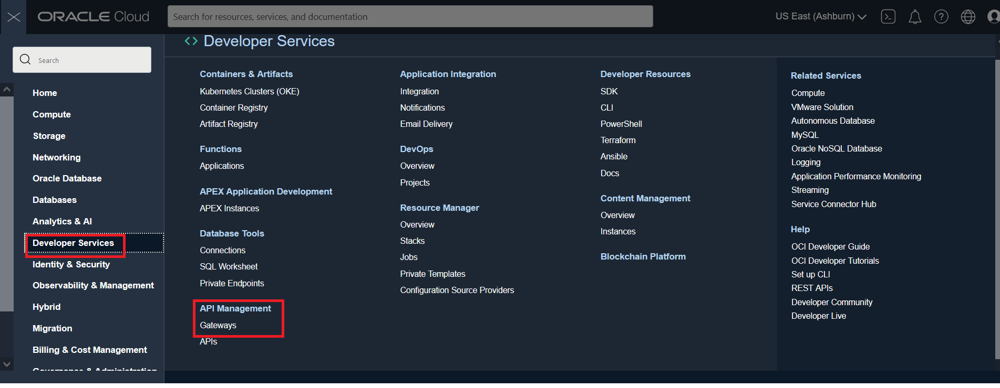


- Copy the URL of the IBGE public API, which we will use.

```python

https://servicodados.ibge.gov.br/api/v1/localidades/estados/

```

- Select the compartment created in the project and click on the API that is active.

  

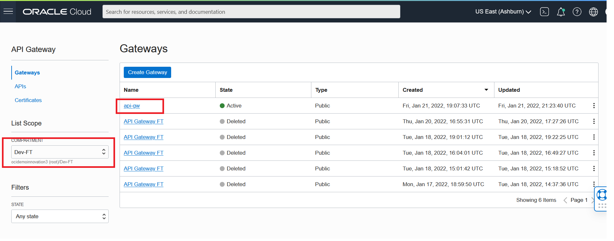

- In the lower left corner, click **Deployments**.

  
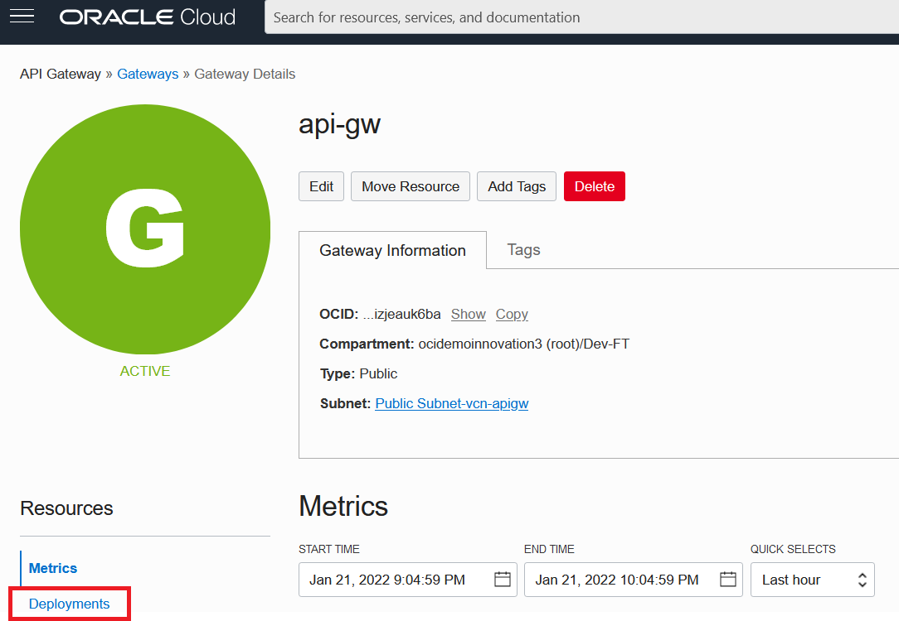

  
- Click the **Create Deployment** button.

  

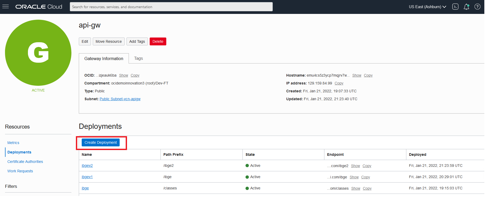

  
- When editing the basic information, enter the following values in the fields:

- name: ibgev1

- path prefix: /ibge

- compartment: \<seu-compartment>

- Keep the other items at the default until you get to API Logging Policies, then select the _Information_ option .


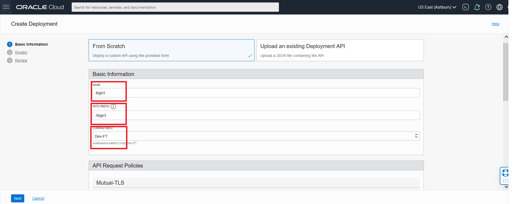

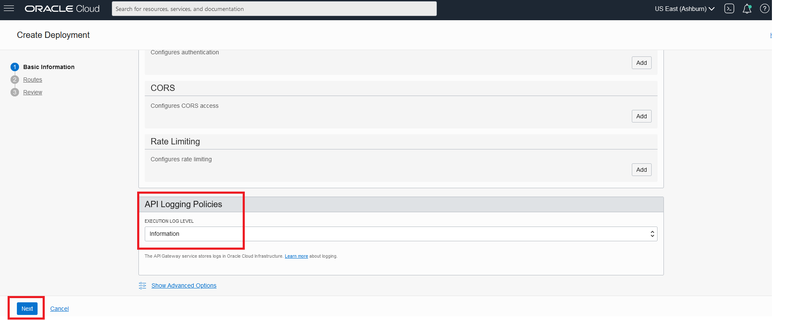

  

- Click **Next**.

- Now, when editing the routes, enter the following values in the fields for the **Route 1**:

- PATH: /estados

- METHODS: GET

- TYPE: HTTP

- URL: `https://servicodados.ibge.gov.br/api/v1/localidades/estados/`

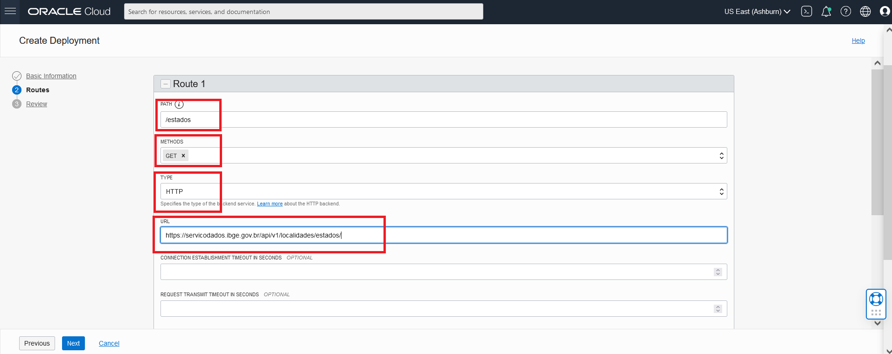

  

- Scroll down and click **+ Another Route**, to add a new route.

  

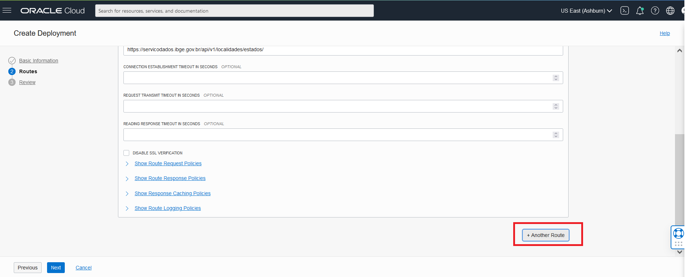

  

- Then enter the following values in the fields for the **Route 2**:

- PATH: /stock

- METHODS: GET

- TYPE: Stock Response

- STATUS CODE: 200

- BODY OPTIONAL: `{"mensagem" "GREAT"}`

- Click **Next** and then click **Create**.

  

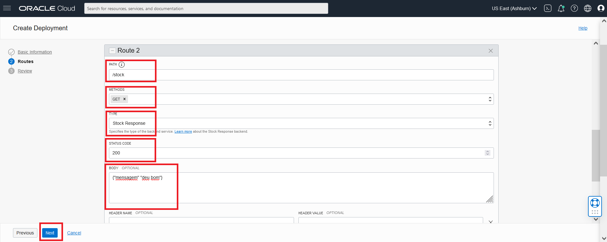

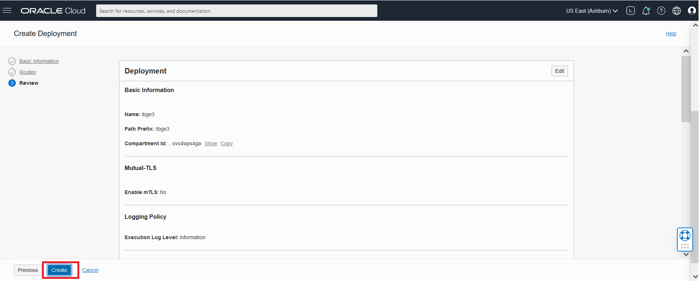

  

- While your _deployment_ is being done, access the **Cloud Shell** by clicking the "**(>_)**" button in the upper right corner.

  

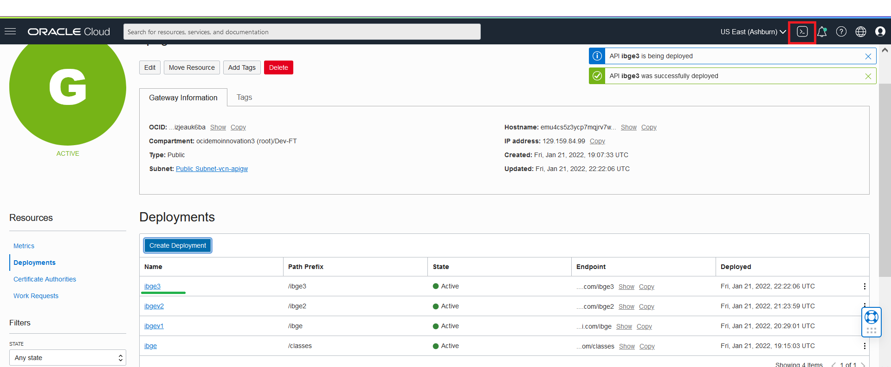

  

- In **Deployments**, copy the **endpoint**, of your deployment (ibgev1), by clicking on the **Copy** option.

  

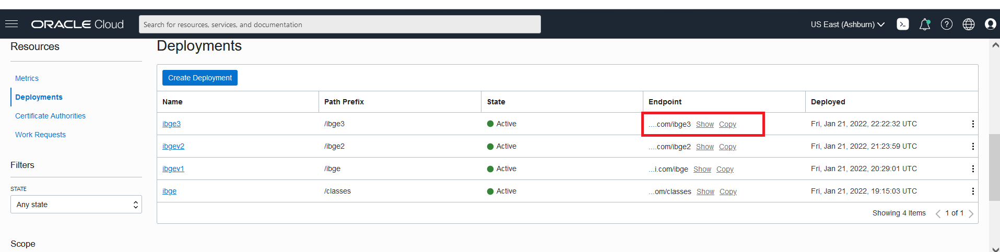

  

- Back in the **Cloud shell**, enter the command:

```python

curl <seu-endpoint>/stock

```


  

- It will return the Body message, which we entered earlier!

  

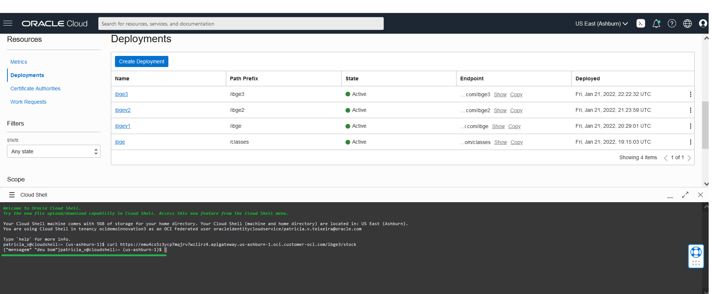

  

- Now, to test using the public API, enter the command:

```python

curl <seu-endpoint>/estados

```

  

- It will return, in the **Cloud Shell**, all the states listed in the API!


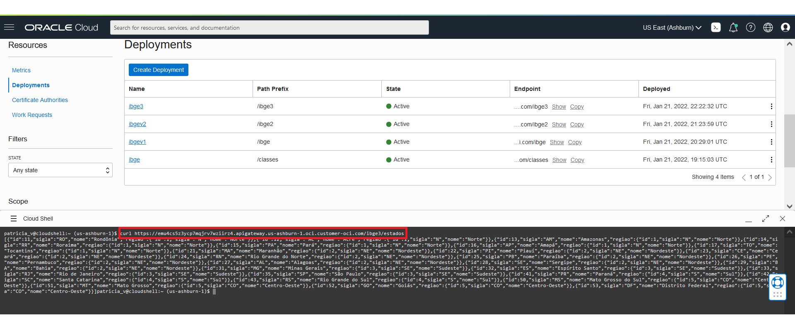

  

Congratulations! You have learned how to create an API Gateway in OCI and implement in it the collection of data using the GET method a public API!